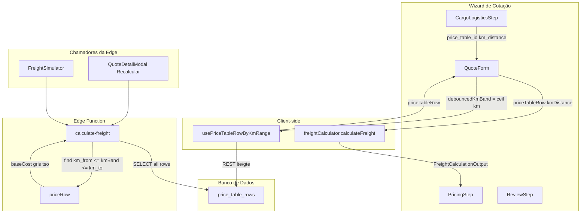

# Análise: price_table_rows e Motor de Precificação

## 1. Estrutura de price_table_rows

### Schema ( migrations )

**Arquivo:** [supabase/migrations/20260206161233_7be6a970-c341-4ba1-a2f4-bc8adc6ec63c.sql](supabase/migrations/20260206161233_7be6a970-c341-4ba1-a2f4-bc8adc6ec63c.sql) (linhas 84-98)


| Coluna             | Tipo    | Uso                                 |
| ------------------ | ------- | ----------------------------------- |
| id                 | uuid PK | Auditoria / meta.price_table_row_id |
| price_table_id     | uuid FK | Agrupamento por tabela              |
| km_from            | integer | Faixa KM inicial (inclusivo)        |
| km_to              | integer | Faixa KM final (inclusivo)          |
| cost_per_ton       | numeric | Lotação: R$/t                       |
| cost_per_kg        | numeric | Lotação: fallback R$/kg             |
| cost_value_percent | numeric | RCTR-C %                            |
| gris_percent       | numeric | GRIS %                              |
| tso_percent        | numeric | TSO %                               |
| toll_percent       | numeric | Pedágio % (legado)                  |
| ad_valorem_percent | numeric | Ad valorem                          |


**Extensão Fracionado:** [data/migration_fracionado.sql](data/migration_fracionado.sql)


| Coluna                | Faixa de peso           |
| --------------------- | ----------------------- |
| weight_rate_10        | 1–10 kg                 |
| weight_rate_20        | 11–20 kg                |
| weight_rate_30        | 21–30 kg                |
| weight_rate_50        | 31–50 kg                |
| weight_rate_70        | 51–70 kg                |
| weight_rate_100       | 71–100 kg               |
| weight_rate_150       | 101–150 kg              |
| weight_rate_200       | 151–200 kg              |
| weight_rate_above_200 | acima de 200 kg (R$/kg) |


**Constraints:** `km_to >= km_from`, UNIQUE(price_table_id, km_from, km_to). Trigger evita sobreposição de faixas.

---

## 2. Arquitetura do Motor de Precificação




### 2.1 Busca da faixa KM


| Componente                | Método                                      | Lógica                                                                                |
| ------------------------- | ------------------------------------------- | ------------------------------------------------------------------------------------- |
| QuoteForm                 | `debouncedKmBand = Math.ceil(km)`           | [QuoteForm.tsx](src/components/forms/QuoteForm.tsx) linhas 323-324                    |
| usePriceTableRowByKmRange | `.lte('km_from', km).gte('km_to', km)`      | [usePriceTableRows.ts](src/hooks/usePriceTableRows.ts) linhas 36-38                   |
| freightCalculator         | `kmBandUsed = Math.round(input.kmDistance)` | Recebe `ceil(km)` do QuoteForm, então round = idempotente                             |
| calculate-freight Edge    | `kmBand = Math.ceil(input.km_distance)`     | [calculate-freight/index.ts](supabase/functions/calculate-freight/index.ts) linha 299 |


**Alinhamento:** Wizard e Edge usam `ceil` para selecionar a faixa. O cliente passa `ceil(km)` ao calculateFreight, então a row é consistente.

---

## 3. Lógica de cálculo por modalidade

### 3.1 Lotação (FTL)


| Etapa           | freightCalculator                                                                            | calculate-freight Edge                   |
| --------------- | -------------------------------------------------------------------------------------------- | ---------------------------------------- |
| Base            | `cost_per_ton > 0 ? (billableWeightKg/1000) * cost_per_ton : billableWeightKg * cost_per_kg` | `(billableWeightKg/1000) * cost_per_ton` |
| Markup          | `markupBase * (1 + markupPercent/100)`                                                       | Equivalente em fluxo posterior           |
| GRIS/TSO/RCTR-C | `cargoValue * (percent/100)`                                                                 | Idem                                     |


### 3.2 Fracionado (LTL)


| Etapa       | freightCalculator                                                 | calculate-freight Edge   |
| ----------- | ----------------------------------------------------------------- | ------------------------ |
| Coluna peso | `getLtlWeightColumn(billableWeightKg)`                            | Idêntico                 |
| Faixas      | 10, 20, 30, 50, 70, 100, 150, 200 kg                              | Mesmas                   |
| Base        | `billableWeightKg * ratePerKg` (faixa) ou `weight_rate_above_200` | Idêntico                 |
| Dispatch    | `ltlParams.dispatchFee` (102.9)                                   | `ltlParams.dispatch_fee` |
| GRIS mínimo | `gris < grisMin` e `cargoValue <= grisMinCargoLimit`              | Idêntico                 |
| TSO mínimo  | `tso < minTso`                                                    | Idêntico                 |


**getLtlWeightColumn** – ambos usam o mesmo conjunto de thresholds:

```
<=10 → weight_rate_10 | <=20 → weight_rate_20 | ... | <=200 → weight_rate_200 | else → weight_rate_above_200
```

---

## 4. Fluxo no Wizard

1. **CargoLogisticsStep:** usuário define `price_table_id` e `km_distance`.
2. **QuoteForm:** `debouncedKmBand = Math.ceil(debounced.kmDistance)`; chama `usePriceTableRowByKmRange(priceTableId, debouncedKmBand)`.
3. **usePriceTableRowByKmRange:** REST `price_table_rows` com `.lte('km_from', km).gte('km_to', km).maybeSingle()`.
4. **calculateFreight:** recebe `priceTableRow` e `kmDistance: debouncedKmBand`; valida `kmBandUsed` dentro de `[km_from, km_to]`.
5. **PricingStep:** mostra Memória e Rentabilidade a partir de `calculationResult`.
6. **Submissão:** `price_table_id` e `km_distance` (inteiro) são gravados na cotação.

---

## 5. Fluxo na Edge Function (Recalcular / Simulador)

1. Entrada: `price_table_id`, `km_distance`, `weight`, `cargo_value`, etc.
2. `kmBand = Math.ceil(km_distance)`.
3. `SELECT * FROM price_table_rows WHERE price_table_id = ? ORDER BY km_from`.
4. `allRows.find(r => r.km_from <= kmBand && r.km_to >= kmBand)`.
5. Uso da row para `baseCost`, `gris_percent`, `tso_percent`, `cost_value_percent`.
6. Resposta inclui `meta.price_table_row_id` para auditoria.

---

## 6. Verificação de alinhamento


| Aspecto                  | Wizard                        | Edge     | Alinhado |
| ------------------------ | ----------------------------- | -------- | -------- |
| Faixa KM                 | ceil(km)                      | ceil(km) | Sim      |
| Condição row             | km_from <= km AND km_to >= km | Idêntico | Sim      |
| Lotação cost_per_ton     | (kg/1000) * cost_per_ton      | Idêntico | Sim      |
| Fracionado weight_rate_* | Mesmas faixas                 | Idêntico | Sim      |
| GRIS/TSO/RCTR-C          | % sobre cargo_value           | Idêntico | Sim      |
| Mínimos LTL              | gris_min, min_tso             | Idêntico | Sim      |


### Observação: usePriceTableRowByKmRange

O hook usa `kmRounded = Math.round(kmDistance)` internamente (linha 29). O QuoteForm passa `debouncedKmBand = Math.ceil(km)` (já inteiro), então o `round` não altera o resultado. Se outro caller passar um km decimal, o hook usaria `round`, e poderia divergir da Edge (que usa `ceil`). Para o Wizard, o alinhamento está correto.

---

## 7. Resumo

A estrutura de `price_table_rows` suporta:

- Lotação: `cost_per_ton` / `cost_per_kg` por faixa KM.
- Fracionado: `weight_rate`_* por faixa de peso, dentro de cada faixa KM.
- Percentuais: GRIS, TSO, cost_value por linha.

O Wizard e a Edge Function estão alinhados em:

- Busca da row por `ceil(km)` com condição inclusiva `km_from <= km <= km_to`.
- Regras de base (lotação e fracionado).
- Faixas de peso LTL idênticas.
- Aplicação de mínimos NTC no fracionado.

Resultado: a lógica implementada no Wizard e na Edge Function `calculate-freight` está consistente com a arquitetura de `price_table_rows`.