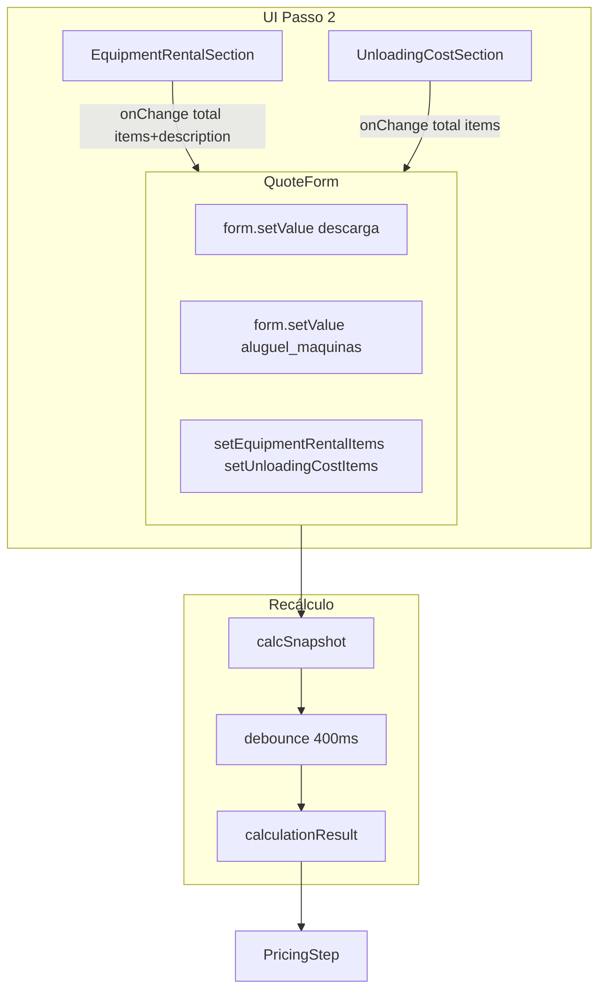

# Plano: Passo 2 Carga/Logística e Central de Regras de Precificação

## 1. Ajustes de UI e Reatividade (Passo 2)

### 1.1 EquipmentRentalSection — Campo Descrição

**Arquivo:** [src/components/quotes/EquipmentRentalSection.tsx](src/components/quotes/EquipmentRentalSection.tsx)

**Alterações:**

- Estender `EquipmentRentalItem` com `description?: string` (texto livre por linha).
- Estado: `Map<string, { selected, quantity, description }>` em vez de `{ selected, quantity }`.
- Adicionar `<Input>` ou `<Textarea>` "Descrição" ao lado de cada item selecionado.
- `onChange(total, items)` passa itens com `description` preenchido.

**Interface atualizada:**

```ts
export interface EquipmentRentalItem {
  id: string;
  name: string;
  code: string;
  selected: boolean;
  quantity: number;
  unitValue: number;
  total: number;
  description?: string;  // novo
}
```

**Persistência:** `StoredPricingBreakdown.meta.equipmentRental[]` e `FreightCalculationInput.extras.equipmentRentalItems` já recebem os itens; incluir `description` em cada objeto. Atualizar tipos em [src/lib/freightCalculator.ts](src/lib/freightCalculator.ts) (linhas 262-280) e em `buildStoredBreakdown`.

**Consumidores:** [QuoteForm.tsx](src/components/forms/QuoteForm.tsx) (equipmentRentalItems), [PricingStep.tsx](src/components/forms/quote-form/steps/PricingStep.tsx), [QuoteFormWizard.tsx](src/components/forms/quote-form/QuoteFormWizard.tsx) — só precisam passar o tipo estendido.

---

### 1.2 UnloadingCostSection — Reatividade

**Problema:** O `form.setValue('descarga', total)` é chamado imediatamente em `onChange`, mas o recálculo usa `debouncedSnapshot` (400ms). O frete só é recalculado após o debounce.

**Arquivo:** [src/components/forms/QuoteForm.tsx](src/components/forms/QuoteForm.tsx) (linhas 267-316)

**Solução sugerida:**

- Criar um debounce em duas fases:
  - Campos de rota/peso (origin, destination, weight, volume, km, price_table): debounce 400ms.
  - Campos de custo (toll, descarga, aluguel_maquinas): sem debounce ou debounce 0ms para recálculo.
- Alternativa simples: ao `onChange` de descarga/aluguel, chamar `form.trigger()` ou forçar o `calcSnapshot` a refletir o novo valor na próxima render, e usar um debounce menor (ex.: 100ms) para custos.

**Implementação mínima:** Usar um único `calcSnapshot` mas incluir `flushKey` que muda quando `descarga` ou `aluguel_maquinas` mudam, e usar `useDeferredValue`/`useTransition` para priorizar custos. Ou reduzir o debounce global para 150–200ms como ajuste pragmático.

**Implementação recomendada:** Separar dependências do cálculo:

- `calcSnapshotStable` = origin, destination, weight, volume, km, price_table, tde, tear → debounce 400ms.
- `calcSnapshotCosts` = toll, descarga, aluguel → sem debounce (ou 50ms).
- `calculationResult` depende de `{ ...debounced(calcSnapshotStable), ...calcSnapshotCosts }`.

---

## 2. Migração SQL — pricing_rules_config

**Novo arquivo:** `supabase/migrations/YYYYMMDDHHMMSS_pricing_rules_config.sql`

```sql
-- Enum para categoria
CREATE TYPE pricing_rule_category AS ENUM (
  'taxa', 'estadia', 'veiculo', 'markup', 'imposto', 'prazo'
);

-- Enum para tipo de valor
CREATE TYPE pricing_rule_value_type AS ENUM (
  'fixed', 'percentage', 'per_km', 'per_ton'
);

CREATE TABLE public.pricing_rules_config (
  id uuid PRIMARY KEY DEFAULT gen_random_uuid(),
  label text NOT NULL,
  key text NOT NULL UNIQUE,
  category pricing_rule_category NOT NULL,
  value_type pricing_rule_value_type NOT NULL,
  value numeric NOT NULL,
  min_value numeric,
  max_value numeric,
  vehicle_type_id uuid REFERENCES public.vehicle_types(id) ON DELETE SET NULL,
  is_active boolean NOT NULL DEFAULT true,
  metadata jsonb DEFAULT '{}',
  created_at timestamptz NOT NULL DEFAULT now(),
  updated_at timestamptz NOT NULL DEFAULT now(),
  CONSTRAINT pricing_rules_config_value_range CHECK (
    (min_value IS NULL OR value >= min_value) AND
    (max_value IS NULL OR value <= max_value)
  )
);

-- RLS, políticas, trigger updated_at, índice por category
CREATE INDEX idx_pricing_rules_config_category ON public.pricing_rules_config(category);
CREATE INDEX idx_pricing_rules_config_key ON public.pricing_rules_config(key);
```

**Seed:** Inserir regras mapeando as constantes atuais de [freightCalculator.ts](src/lib/freightCalculator.ts) (cubage_factor, das_percent, markup, overhead, target_margin, tde, tear, etc.) para linhas em `pricing_rules_config`.

---

## 3. Tabelas de Apoio

### 3.1 vehicle_types

**Situação:** Já existe em [supabase/migrations/20260207015416_*.sql](supabase/migrations/20260207015416_395a1f49-0516-4c8e-8a2d-da44abf4f61d.sql) com: `id`, `code`, `name`, `axes_count`, `capacity_kg`, `capacity_m3`.

**Ajuste:** Inclusão de `external_id` para integração com sistemas externos:

```sql
ALTER TABLE public.vehicle_types ADD COLUMN IF NOT EXISTS external_id text;
CREATE UNIQUE INDEX IF NOT EXISTS idx_vehicle_types_external_id 
  ON public.vehicle_types(external_id) WHERE external_id IS NOT NULL;
```

`axes_count` pode ser tratado como "axes" sem alteração de schema.

### 3.2 payment_terms

**Situação:** Já existe com `id`, `code`, `name`, `days`, `adjustment_percent`, `advance_percent`.

**Mapeamento:** `name` ≈ label, `days` ≈ days_to_pay.

**Ajuste opcional:** Coluna `type` para classificação (ex.: à vista, parcelado):

```sql
ALTER TABLE public.payment_terms ADD COLUMN IF NOT EXISTS type text 
  CHECK (type IN ('avista', 'parcelado', 'custom'));
```

---

## 4. PricingRulesManager — Scaffold

**Novo arquivo:** `src/components/pricing/PricingRulesManager.tsx`

**Funções:**

- Listar regras por `category` (agrupadas ou em abas).
- Edição rápida: `value`, `min_value`, `max_value`, `is_active`.
- Usar `useQuery` + mutation para CRUD em `pricing_rules_config`.
- Layout: tabela ou cards por categoria, com filtro por `vehicle_type_id` quando aplicável.

**Hook:** `usePricingRulesConfig(category?: string)` — busca regras ativas, com cache por categoria.

**Integração:** Incluir `PricingRulesManager` na [PricingRulesTab](src/components/pricing/PricingRulesTab.tsx) como novo AccordionItem "Central de Regras" ou seção equivalente.

---

## 5. Próximos passos (fora do escopo imediato)

- `freightCalculator` e Edge Function `calculate-freight` migrarem de `FREIGHT_CONSTANTS` e `pricing_parameters` para `pricing_rules_config` via `resolveParams()`.
- `usePricingRulesConfig` ou Provider para alimentar o motor de precificação com regras dinâmicas.
- Documentação do mapeamento `key` → constante (ex.: `estadia_free_hours`, `markup_percent`).

---

## 6. Fluxo de dados (visão geral)




---

## 7. Ordem sugerida de implementação

1. Migração SQL: `pricing_rules_config`, alterações em `vehicle_types` e `payment_terms`.
2. EquipmentRentalSection: adicionar `description` e ajustar tipos/persistência.
3. UnloadingCostSection / QuoteForm: debounce separado para custos (reatividade).
4. Hook `usePricingRulesConfig` e scaffold `PricingRulesManager`.
5. Integrar `PricingRulesManager` em `PricingRulesTab`.
6. (Futuro) Refatorar `freightCalculator` para consumir `pricing_rules_config`.

