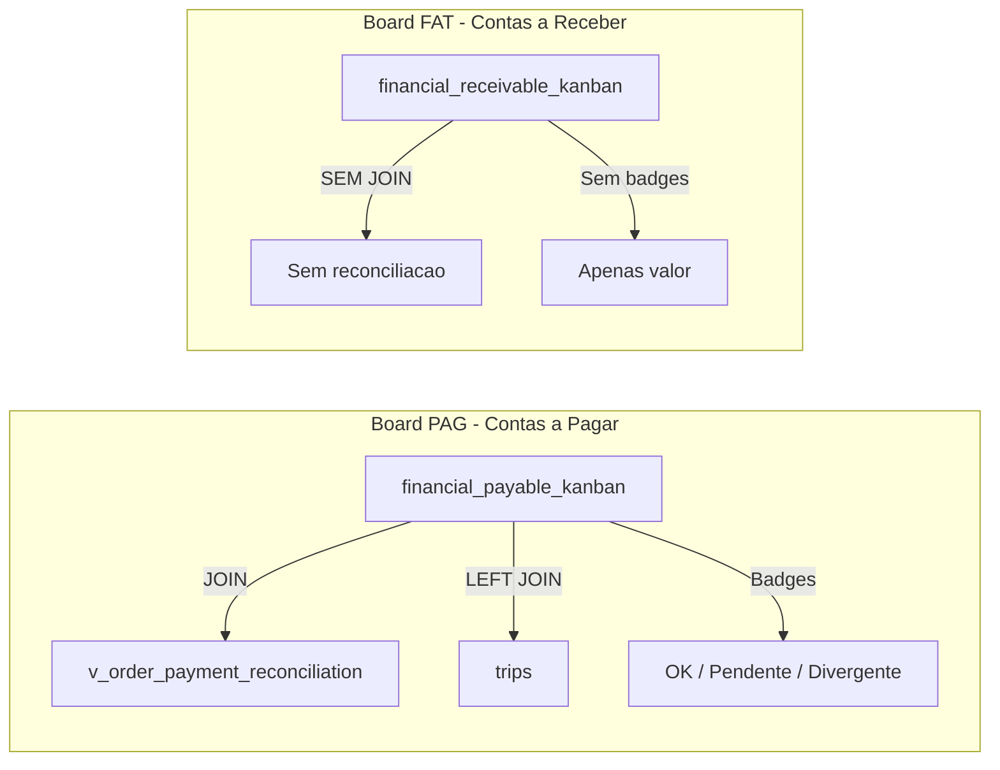
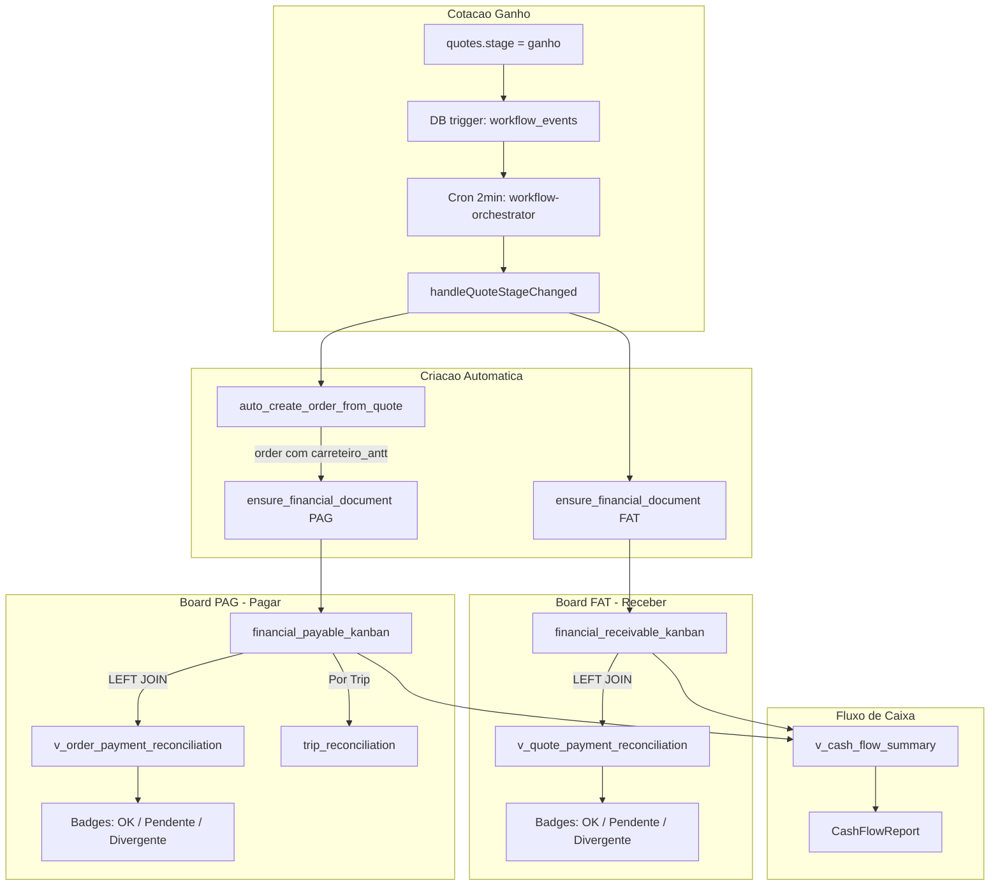

# Conciliacao FAT, Recalcular JWT e Fluxo de Caixa

## Problema 1: Erro JWT no Recalcular

O botão "Recalcular" no `QuoteDetailModal` chama `invokeEdgeFunction('calculate-freight')`, que:

1. Obtém token via `supabase.auth.getSession()` (pode retornar token expirado do cache)
2. Envia para a Edge Function, que valida com `supabase.auth.getUser()`
3. Se 401, tenta `refreshSession()` e reenvia

O problema provável: `getSession()` retorna token expirado, `getUser()` falha, e o retry com `refreshSession()` também falha (refresh token expirado ou sessão inativa por muito tempo).

**Correção**: Forçar `getUser()` no client antes de invocar (ele força refresh automático), e tratar o fallback de forma mais robusta em `buildAuthHeaders` dentro de [src/lib/edgeFunctions.ts](src/lib/edgeFunctions.ts).

```typescript
// Em buildAuthHeaders, substituir getSession() por getUser() que auto-refresh:
const { data: { user }, error } = await supabase.auth.getUser();
if (error || !user) {
  // fallback: tentar getSession() para manter compatibilidade
  const { data: { session } } = await supabase.auth.getSession();
  if (!session?.access_token) {
    if (requireAuth) throw new Error('Sessao expirada...');
    return baseHeaders;
  }
  return { ...baseHeaders, Authorization: `Bearer ${session.access_token}` };
}
// Após getUser() bem-sucedido, pegar a session atualizada
const { data: { session } } = await supabase.auth.getSession();
```

---

## Problema 2: Conciliacao FAT ausente no Board Financeiro

### Estado atual




A view `financial_receivable_kanban` nao faz JOIN com `v_quote_payment_reconciliation`, portanto os cards FAT nunca exibem badges de conciliacao (OK, Pendente, Divergente).

### Solucao: Espelhar PAG no FAT

**Fase 2A - Migration: Enriquecer a view FAT**

Nova migration que recria `financial_receivable_kanban` com LEFT JOIN na `v_quote_payment_reconciliation`:

```sql
drop view if exists public.financial_receivable_kanban;

create view public.financial_receivable_kanban as
select
  k.*,
  q.client_name, q.origin, q.destination,
  q.origin_cep, q.destination_cep,
  q.value as quote_value,
  q.cargo_type, q.weight, q.volume,
  q.km_distance, q.freight_type, q.freight_modality,
  q.toll_value, q.pricing_breakdown, q.shipper_name,
  -- Reconciliacao FAT (espelho do PAG)
  coalesce(r.expected_amount, 0)::numeric as expected_amount,
  coalesce(r.paid_amount, 0)::numeric    as paid_amount,
  coalesce(r.delta_amount, 0)::numeric   as delta_amount,
  coalesce(r.is_reconciled, false)       as is_reconciled,
  coalesce(r.proofs_count, 0)::int       as proofs_count,
  vt.name as vehicle_type_name, vt.code as vehicle_type_code, vt.axes_count,
  pt.name as payment_term_name, pt.code as payment_term_code,
  pt.days as payment_term_days,
  pt.adjustment_percent as payment_term_adjustment,
  pt.advance_percent    as payment_term_advance
from public.financial_documents_kanban k
join public.quotes q on q.id = k.source_id
left join public.v_quote_payment_reconciliation r on r.quote_id = q.id
left join public.vehicle_types vt on vt.id = q.vehicle_type_id
left join public.payment_terms pt on pt.id = q.payment_term_id
where k.type = 'FAT';
```

**Fase 2B - Frontend: Badges de conciliacao no FinancialCard para FAT**

Arquivo: [src/components/financial/FinancialCard.tsx](src/components/financial/FinancialCard.tsx)

Atualmente os badges so renderizam quando `row.trip_id ?? row.trip_number` existe (linhas 104-151). Para FAT, nao ha trip, entao o bloco nunca aparece.

Alterar a condicao para renderizar badges de reconciliacao tanto para PAG (com trip chip) quanto para FAT (sem trip chip, mas com badges):

```tsx
{/* Reconciliation badges (PAG com trip, FAT sem trip) */}
{(row.trip_id ?? row.trip_number) && (
  <span className="..."><Truck /> {row.trip_number}</span>
)}
{/* Badges de reconciliacao para AMBOS os tipos */}
{row.expected_amount != null && Number(row.expected_amount) > 0 && (
  <>
    {row.is_reconciled === true && (<span>OK</span>)}
    {row.is_reconciled === false && row.proofs_count > 0 && row.paid_amount === 0 && (
      <span>Pendente confirmacao</span>
    )}
    {/* ... demais badges ... */}
  </>
)}
```

**Fase 2C - FinancialDetailModal: Secao de conciliacao FAT**

Arquivo: [src/components/modals/FinancialDetailModal.tsx](src/components/modals/FinancialDetailModal.tsx)

Adicionar secao "Conciliacao de Recebimento" quando `doc.type === 'FAT'`, similar ao que `OrderDetailModal` faz para PAG. Usar `useQuoteReconciliation(doc.source_id)` e `useQuotePaymentProofsByQuote(doc.source_id)` de [src/hooks/useQuotePaymentProofs.ts](src/hooks/useQuotePaymentProofs.ts).

---

## Problema 3: Esqueleto de Fluxo de Caixa

Nao existe nenhum codigo de fluxo de caixa no projeto. Criar a base:

**Fase 3A - View SQL: `v_cash_flow_summary`**

Nova migration com uma view que agrega FAT e PAG por periodo:

```sql
create or replace view public.v_cash_flow_summary as
select
  date_trunc('month', coalesce(fi.due_date, fd.created_at)) as period,
  fd.type,
  fd.status,
  count(*) as doc_count,
  coalesce(sum(fd.total_amount), 0) as total_amount,
  coalesce(sum(fi.amount) filter (where fi.status = 'settled'), 0) as settled_amount,
  coalesce(sum(fi.amount) filter (where fi.status = 'pending'), 0) as pending_amount
from public.financial_documents fd
left join public.financial_installments fi on fi.financial_document_id = fd.id
group by 1, 2, 3;
```

**Fase 3B - Hook: `useCashFlowSummary`**

Novo hook em `src/hooks/useCashFlowSummary.ts` que consulta a view e agrupa por mes, separando entradas (FAT) e saidas (PAG).

**Fase 3C - Componente esqueleto: `CashFlowReport`**

Novo componente em `src/components/financial/CashFlowReport.tsx` com:

- Tabela resumo por mes: Entradas (FAT recebido) | Saidas (PAG pago) | Saldo
- Filtros por periodo
- Placeholder para grafico futuro (Recharts)

Integrar como nova aba "Fluxo de Caixa" na pagina [src/pages/Financial.tsx](src/pages/Financial.tsx), ao lado das abas "Receber" e "Pagar".

---

## Fluxo Completo: Ganho ate Board Financeiro




## Arquivos impactados


| Arquivo                                          | Alteracao                                                    |
| ------------------------------------------------ | ------------------------------------------------------------ |
| `src/lib/edgeFunctions.ts`                       | Fix JWT: usar `getUser()` antes de `getSession()`            |
| Nova migration                                   | Recriar `financial_receivable_kanban` com JOIN reconciliacao |
| Nova migration                                   | View `v_cash_flow_summary`                                   |
| `src/types/financial.ts`                         | Tipos ja suportam campos de reconciliacao (OK)               |
| `src/components/financial/FinancialCard.tsx`     | Badges FAT (desacoplar de trip)                              |
| `src/components/modals/FinancialDetailModal.tsx` | Secao conciliacao FAT                                        |
| `src/hooks/useCashFlowSummary.ts`                | Novo hook                                                    |
| `src/components/financial/CashFlowReport.tsx`    | Novo componente esqueleto                                    |
| `src/pages/Financial.tsx`                        | Nova aba "Fluxo de Caixa"                                    |


