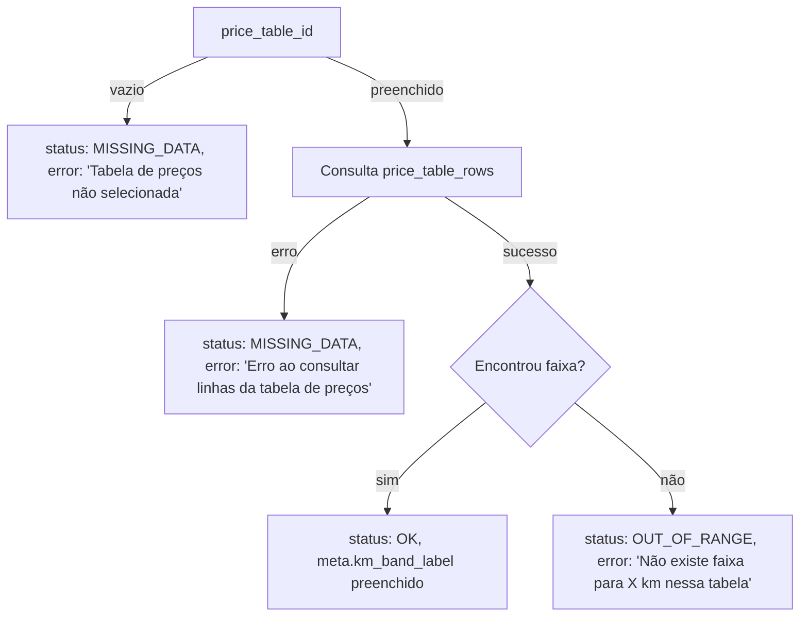

# Avaliação do Plano: Correção Lotação — Faixa não puxada em price_table_rows

## Contexto

O plano proposto foca em [supabase/functions/calculate-freight/index.ts](supabase/functions/calculate-freight/index.ts). A função é usada pelo **FreightSimulator** (via `useCalculateFreight`), não pelo QuoteForm (que usa `price-row` + `freightCalculator` client-side).

## Estado atual do código

A implementação atual já:

- **Normaliza KM** (linha 190): `kmForBand = Math.round(Number(input.km_distance))`
- **Evita 22P02**: busca todas as linhas com `.select('*').eq('price_table_id', ...)` e filtra em JS com `km_from <= kmForBand && km_to >= kmForBand` — não usa filtro por km no PostgREST
- **Preenche** `meta.km_band_label` quando encontra a faixa (linha 204)

Não há risco de 22P02 na função atual; o filtro é feito em memória.

## Avaliação do plano

### 1) Normalizar KM antes de consultar price_table_rows

**Status:** Já implementado.  
**Recomendação:** Manter `kmBand = Math.round(km_distance)` e padronizar o nome da variável para `kmBand` para alinhar com o plano.

### 2) Ajustar a query de faixa (forma robusta)

**Status:** Parcialmente implementado. O código atual busca todas as linhas e filtra em JS com `km_from <= kmForBand && km_to >= kmBand`.

**Opções:**

- **Opção A (mantenha):** Buscar todas as linhas e filtrar em JS — simples, robusto, evita 22P02, mas pode ser lento em tabelas com muitas faixas.
- **Opção B (plano):** Usar filtro no PostgREST: `.eq('price_table_id', id).lte('km_from', kmBand).gte('km_to', kmBand)` e, se vazio, fallback: `.lte('km_from', kmBand).order('km_from', { ascending: false }).limit(1)` e validar `km_to >= kmBand`.

**Recomendação:** Manter a abordagem atual (buscar todas e filtrar). Se houver muitas faixas, a opção B pode ser considerada depois. O fallback do plano é mais útil se a RPC `find_price_row_by_km` for usada com decimal e causar erro.

### 3) Corrigir mensagens de erro

**Status:** Precisa de ajuste. O código atual:

- Não usa `status: 'MISSING_DATA'` quando não há `price_table_id`
- Usa `error` genérico quando `OUT_OF_RANGE` (`Distância ${km} km fora da faixa`)
- Não diferencia entre “tabela não selecionada”, “erro na consulta” e “faixa não encontrada”

**Implementação sugerida:**




**Alterações:**

- Se `!input.price_table_id`: retornar `status: 'MISSING_DATA'`, `error: 'Tabela de preços não selecionada'`
- Se `price_table_id` existe mas a consulta falha (ex.: `error` do Supabase): retornar `status: 'MISSING_DATA'`, `error: 'Erro ao consultar linhas da tabela de preços'`
- Se consulta ok mas nenhuma faixa encontrada: retornar `status: 'OUT_OF_RANGE'`, `error: 'Não existe faixa para ${kmBand} km nessa tabela'` (usar `kmBand` inteiro na mensagem)

### 4) Preencher meta.km_band_label e campos opcionais

**Status:** `km_band_label` já é preenchido quando a faixa é encontrada.

**Alterações sugeridas:**

- Adicionar `km_band_used = kmBand` em `meta` (inteiro usado na busca)
- Adicionar `price_table_row_id = row.id` em `meta` (opcional, para auditoria)

**Tipos:** Atualizar `FreightMeta` em [supabase/functions/_shared/freight-types.ts](supabase/functions/_shared/freight-types.ts) e [src/types/freight.ts](src/types/freight.ts):

```ts
km_band_used?: number;      // opcional
price_table_row_id?: string; // opcional
```

## Resumo de alterações


| Item                   | Ação                                                                                 |
| ---------------------- | ------------------------------------------------------------------------------------ |
| 1. Normalizar KM       | Manter `Math.round(km_distance)`, renomear variável para `kmBand`                    |
| 2. Query robusta       | Manter busca atual (fetch all + filter). Fallback opcional se quiser otimizar depois |
| 3. Mensagens de erro   | Implementar: sem tabela vs erro de consulta vs faixa não encontrada                  |
| 4. meta                | `km_band_label` já ok; adicionar `km_band_used` e `price_table_row_id` opcionalmente |
| 5. status MISSING_DATA | Retornar quando `!price_table_id` ou quando a consulta falhou                        |


## Observação sobre price-row

O QuoteForm usa `usePriceTableRowByKmFromEdgeFn`, que chama a Edge Function **price-row** com `body: { price_table_id, km, rounding }`. A função **price-row** espera `body: { p_price_table_id, p_km_numeric, p_rounding }`. Há incompatibilidade de nomes de parâmetros; isso pode causar falhas na busca de faixa no QuoteForm. Para o QuoteForm, seria necessário ajustar a price-row ou o payload do hook. O plano atual foca apenas em **calculate-freight**, conforme solicitado.