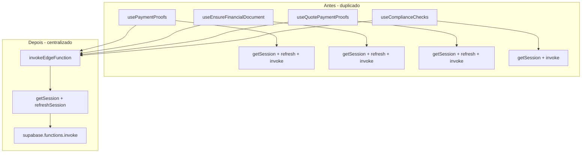

# Fatia 2: Centralização da Chamada de Edge Functions (Supabase)

## Contexto

Existe duplicação do bloco de autenticação (getSession + refreshSession + token) em vários hooks que chamam Edge Functions. Além disso, há um [src/lib/edgeFunctions.ts](src/lib/edgeFunctions.ts) já utilizado por useAiInsights, useCepLookup, useCalculateFreight, useSendQuoteEmail, etc., com API diferente (`invokeEdgeFunction(name, { body })` e auth interna via `buildAuthHeaders`).

O plano abaixo segue a abordagem solicitada: criar um novo utilitário `supabase-invoke.ts` com API simplificada e migrar os hooks que ainda usam token manual.

## Escopo da migração


| Hook / Local                                                             | Edge Function               | Status atual                |
| ------------------------------------------------------------------------ | --------------------------- | --------------------------- |
| [usePaymentProofs.ts](src/hooks/usePaymentProofs.ts)                     | process-payment-proof       | Token manual                |
| [useEnsureFinancialDocument.ts](src/hooks/useEnsureFinancialDocument.ts) | ensure-financial-document   | Token manual                |
| [useQuotePaymentProofs.ts](src/hooks/useQuotePaymentProofs.ts)           | process-quote-payment-proof | Token manual                |
| [useComplianceChecks.ts](src/hooks/useComplianceChecks.ts)               | ai-operational-orchestrator | Token manual (sem refresh)  |
| [useDriverQualification.ts](src/hooks/useDriverQualification.ts)         | ai-operational-orchestrator | Token manual (sem refresh)  |
| [QuoteDetailModal.tsx](src/components/modals/QuoteDetailModal.tsx)       | ensure-financial-document   | Inline (handleConvertToFAT) |


O `useSendQuoteEmail` já usa `edgeFunctions.invokeEdgeFunction`, mas ainda repete getSession/refresh e passa headers — redundante. Fica fora do escopo desta fatia (possível fase 2).

---

## Passo 1: Criar o utilitário central

Criar [src/lib/supabase-invoke.ts](src/lib/supabase-invoke.ts) com:

- `invokeEdgeFunction<T>(functionName, body)`: obtém token via getSession, tenta refreshSession se faltar, injeta `Authorization`, invoca a função e trata erro no body (`data.error`).
- Tipagem do parâmetro `body`: `Record<string, unknown>` (ou `any` para flexibilidade com tipos complexos).

```ts
// Estrutura principal
export async function invokeEdgeFunction<T>(
  functionName: string,
  body: Record<string, unknown>
): Promise<T> {
  // getSession → refreshSession se necessário → token
  // supabase.functions.invoke(name, { body, headers: { Authorization } })
  // if (data?.error) throw new Error(data.error)
  return data as T;
}
```

---

## Passo 2: Migrar os hooks

### 2.1 usePaymentProofs (useProcessPaymentProof)

- Remover: bloco getSession/refreshSession (linhas ~87–93) e invocação manual.
- Adicionar: `import { invokeEdgeFunction } from '@/lib/supabase-invoke'`.
- Substituir `mutationFn` por:

```ts
mutationFn: async (documentId: string): Promise<ProcessPaymentProofResponse> => {
  const data = await invokeEdgeFunction<ProcessPaymentProofResponse>(
    'process-payment-proof',
    { documentId }
  );
  return data ?? { success: false };
},
```

Observação: o utilitário já trata `data?.error`; manter `return data ?? { success: false }` por compatibilidade com respostas vazias.

### 2.2 useEnsureFinancialDocument

- Remover: bloco de auth e invocação manual (linhas ~20–34).
- Adicionar: `import { invokeEdgeFunction } from '@/lib/supabase-invoke'`.
- Substituir `mutationFn` por:

```ts
mutationFn: async (input: EnsureFinancialDocumentInput) => {
  return invokeEdgeFunction<EnsureFinancialDocumentResponse>(
    'ensure-financial-document',
    input
  );
},
```

### 2.3 useQuotePaymentProofs (useProcessQuotePaymentProof)

- Remover: bloco de auth e invocação manual (linhas ~68–82).
- Adicionar: `import { invokeEdgeFunction } from '@/lib/supabase-invoke'`.
- Substituir `mutationFn` por:

```ts
mutationFn: async (documentId: string) => {
  return invokeEdgeFunction('process-quote-payment-proof', { documentId });
},
```

### 2.4 useComplianceChecks (useRequestComplianceCheck)

- Remover: dependência de `useAuth` para token e bloco de auth (linhas ~97–116).
- Adicionar: `import { invokeEdgeFunction } from '@/lib/supabase-invoke'`.
- Substituir `mutationFn` por:

```ts
mutationFn: async ({ orderId, checkType }: { orderId: string; checkType: ComplianceCheck['check_type'] }) => {
  return invokeEdgeFunction('ai-operational-orchestrator', {
    analysisType: 'compliance_check',
    orderId,
    entityId: orderId,
    entityType: 'order',
    checkType,
  });
},
```

- Remover: `const { session } = useAuth();` do componente se não for mais usado (verificar outros usos no arquivo).

### 2.5 useDriverQualification (useRequestDriverQualification) — extensão opcional

- Mesmo padrão: trocar auth manual por `invokeEdgeFunction('ai-operational-orchestrator', { analysisType: 'driver_qualification', orderId, entityId: orderId, entityType: 'order', driverCpf })`.
- Remover `useAuth` se ficar órfão.

### 2.6 QuoteDetailModal (handleConvertToFAT) — extensão opcional

- Substituir o bloco try/catch inline (linhas ~368–405) por:

```ts
const data = await invokeEdgeFunction<{ data?: { id?: string; created?: boolean }; error?: string }>(
  'ensure-financial-document',
  { docType: 'FAT', sourceId: quote.id, totalAmount: totalClienteView || Number(quote.value) || null }
);
toast.success(data?.data?.created ? 'FAT criado com sucesso' : 'FAT já existente');
queryClient.invalidateQueries({ queryKey: ['financial-documents'] });
```

- Usar o hook `useEnsureFinancialDocument` se o modal já tiver acesso ao mutation — evita código duplicado e centraliza invalidação. Se não, manter a chamada direta via `invokeEdgeFunction` como acima.

---

## Validação

- `npm run lint` sem novos erros nos arquivos alterados.
- `npm run build` passando.
- Teste manual dos fluxos: processar comprovante (PAG/FAT), garantir documento, compliance check e (se migrado) qualificação de motorista e conversão para FAT no modal.

---

## Diagrama do fluxo




---

## Observação sobre edgeFunctions.ts

O [src/lib/edgeFunctions.ts](src/lib/edgeFunctions.ts) permanece com sua API e retry em 401, usado por useAiInsights, useCepLookup, etc. A migração futura pode unificar tudo em um único módulo (`supabase-invoke` ou `edgeFunctions`) com uma API consistente; por ora, os dois coexistem sem conflito.