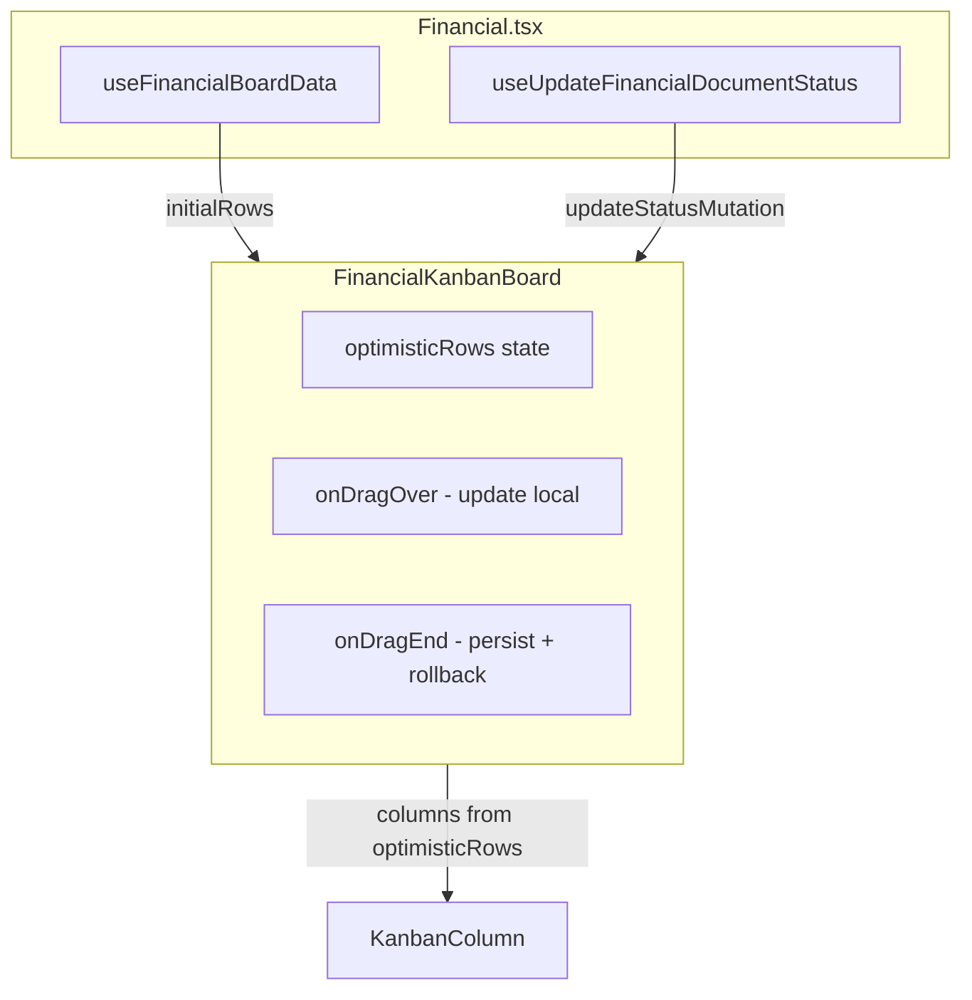

# Plano: FinancialKanbanBoard com Optimistic DnD

## Contexto

O Kanban financeiro hoje só atualiza visualmente após a mutation e o refetch. O padrão otimista resolve isso: `onDragOver` altera o estado local em tempo real; `onDragEnd` persiste e, em caso de erro, reverte.

## Arquitetura




## Ajustes ao snippet do usuário

1. **Mutation**: Usar `{ id, status }` (não `newStatus`), conforme [useUpdateFinancialDocumentStatus.ts](src/hooks/useUpdateFinancialDocumentStatus.ts).
2. **Status válidos**: FAT: INCLUIR, GERADO, AGUARDANDO, RECEBIDO, FINALIZADO. PAG: INCLUIR, GERADO, AGUARDANDO, PAGO, FINALIZADO. Derivar de `columnsConfig` ou `type`.
3. **Toast**: Manter `toast.success` e `toast.error` da implementação atual.
4. **Reuso**: Usar [KanbanColumn](src/components/boards/KanbanColumn.tsx) e [FinancialCard](src/components/financial/FinancialCard.tsx); não criar `FinancialKanbanColumn`.
5. **Collision**: Trocar `closestCenter` por `closestCorners` para melhor detecção de colunas.
6. **Acessibilidade**: Adicionar `KeyboardSensor` com `sortableKeyboardCoordinates`.

## Implementação

### 1. Criar [src/components/financial/kanban/FinancialKanbanBoard.tsx](src/components/financial/kanban/FinancialKanbanBoard.tsx)

- Props: `initialRows`, `type` (FinancialDocType), `columnsConfig`, `updateStatusMutation`, `onCardClick`.
- Estado: `optimisticRows`, `activeId`.
- `useEffect`: Sincronizar `optimisticRows` com `initialRows` quando `!activeId`.
- `handleDragStart`: `setActiveId(active.id)`.
- `handleDragOver`: Se `over.id` for coluna válida, usar diretamente; se for id de card, obter o status desse card. Atualizar `optimisticRows` com `status` do item arrastado.
- `handleDragEnd`: Calcular `targetStatus` igual ao `handleDragOver`; chamar `updateStatusMutation.mutateAsync({ id, status })`; em sucesso, deixar o React Query invalidar; em erro, `setOptimisticRows(initialRows)` e `toast.error`.
- Sensores: `PointerSensor` (distance: 8) e `KeyboardSensor`.
- Render: `groupFinancialKanbanColumns(optimisticRows, type)` para as colunas; mapear para `KanbanColumn` + `FinancialCard`; `DragOverlay` com `FinancialCard` do `activeRow`.

### 2. Atualizar [src/pages/Financial.tsx](src/pages/Financial.tsx)

- Remover: imports de `DndContext`, `DragEndEvent`, `DragOverlay`, `DragStartEvent`, `closestCenter`, `PointerSensor`, `useSensor`, `useSensors`; estado `activeDoc`; `sensors`; `handleDragStart`; `handleDragEnd`.
- Trocar o bloco `DndContext` pelo uso de `FinancialKanbanBoard`:

```tsx
<FinancialKanbanBoard
  initialRows={boardData.rows}
  type={activeType!}
  columnsConfig={columnsConfig}
  updateStatusMutation={updateStatusMutation}
  onCardClick={setSelectedDoc}
/>
```

- Manter `selectedDoc` e `FinancialDetailModal` inalterados.

### 3. Detalhes de implementação

- **findTargetStatus(overId, columnsConfig, rows)**: Se `columnsConfig.some(c => c.id === overId)` retorna `overId`; senão, se `rows.find(r => r.id === overId)` existe, retorna `row.status`.
- **Rollback**: No `catch` de `handleDragEnd`, chamar `setOptimisticRows([...initialRows])` para forçar novo array e garantir re-render.
- **DragOverlay**: Usar `defaultDropAnimationSideEffects` para animação de drop.

## Arquivos afetados


| Arquivo                                                    | Ação                                      |
| ---------------------------------------------------------- | ----------------------------------------- |
| `src/components/financial/kanban/FinancialKanbanBoard.tsx` | Criar                                     |
| `src/pages/Financial.tsx`                                  | Refatorar (remover DnD, delegar ao Board) |


## Validação

- Build sem erros.
- Arrastar card entre colunas: feedback imediato (card muda de coluna).
- Em erro de mutation: card volta à coluna original e toast de erro.
- Em sucesso: toast "Movido para {label}", dados sincronizam após invalidação do React Query.

