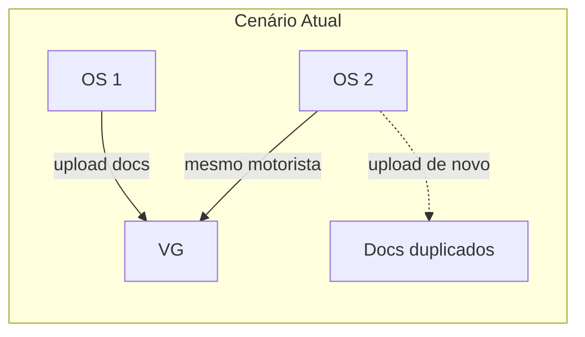
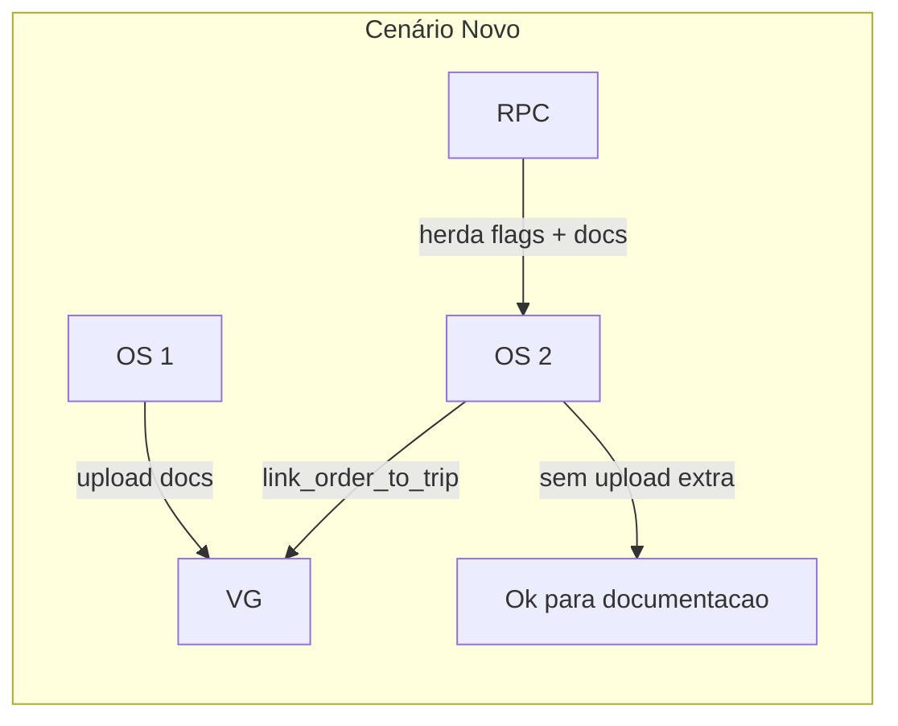

# Plano: Herança de Documentação do Motorista na Transição OS → VG

## Contexto do Problema

Quando uma OS é vinculada a uma viagem (VG) criada a partir de outra OS com o mesmo motorista, o usuário precisa fazer upload novamente de CNH, CRLV, comprovante de residência e ANTT, mesmo sendo o mesmo condutor. O `stageGateWorker` exige essas flags (`has_cnh`, `has_crlv`, `has_comp_residencia`, `has_antt_motorista`) para avançar de `busca_motorista` para `documentacao`.




## Solução

Herdar documentação do motorista (flags + registros em `documents`) ao vincular uma OS a uma viagem que já possui outra OS com o mesmo `driver_id` e docs completos.

---

## 1. Backend: Migration para estender `link_order_to_trip`

**Arquivo:** Nova migration em `supabase/migrations/` (ex: `YYYYMMDD_inherit_driver_docs_on_link_trip.sql`)

**Alterações no RPC `link_order_to_trip`:**

Após o `UPDATE public.orders SET trip_id = v_trip_id` (linha 55), inserir bloco:

1. Buscar outra OS na mesma trip com mesmo `driver_id` que tenha `has_cnh`, `has_crlv`, `has_comp_residencia`, `has_antt_motorista` = true.
2. Se existir:
  - Atualizar a OS recém-vinculara com essas flags (`has_cnh`, `has_crlv`, `has_comp_residencia`, `has_antt_motorista`).
  - Para cada documento de tipo `cnh`, `crlv`, `comp_residencia`, `antt_motorista` da OS origem, inserir em `documents` um novo registro com: mesmo `file_url`, `file_name`, `type`, `file_size`; `order_id` = OS destino; `quote_id` = null; `uploaded_by` = id do usuário que fez o upload original (ou `created_by` da ordem destino, conforme política); `trip_id` opcional da trip.

**Pseudocódigo:**

```sql
-- Após update orders set trip_id
select o2.id, o2.has_cnh, o2.has_crlv, o2.has_comp_residencia, o2.has_antt_motorista
  into v_src_order
  from public.trip_orders tro
  join public.orders o2 on o2.id = tro.order_id
  where tro.trip_id = v_trip_id and o2.id != p_order_id
    and o2.driver_id = v_order.driver_id
    and coalesce(o2.has_cnh, false) and coalesce(o2.has_crlv, false)
    and coalesce(o2.has_comp_residencia, false) and coalesce(o2.has_antt_motorista, false)
  limit 1;

if v_src_order.id is not null then
  update public.orders set
    has_cnh = v_src_order.has_cnh,
    has_crlv = v_src_order.has_crlv,
    has_comp_residencia = v_src_order.has_comp_residencia,
    has_antt_motorista = v_src_order.has_antt_motorista,
    updated_at = now()
  where id = p_order_id;

  insert into public.documents (order_id, type, file_name, file_url, file_size, uploaded_by)
  select p_order_id, d.type, d.file_name, d.file_url, d.file_size, d.uploaded_by
  from public.documents d
  where d.order_id = v_src_order.id
    and d.type in ('cnh','crlv','comp_residencia','antt_motorista');
end if;
```

---

## 2. Frontend: Ajustes na UI

### 2.1 DocumentUpload – filtrar tipos herdados

**Arquivo:** [src/components/documents/DocumentUpload.tsx](src/components/documents/DocumentUpload.tsx)

- Adicionar props opcionais: `driverDocsInherited?: boolean` ou `hasDriverDocs?: { has_cnh, has_crlv, has_comp_residencia, has_antt_motorista }`.
- Quando `driverDocsInherited === true` (ou as 4 flags estiverem preenchidas) e o contexto for ordem (não `carrier_payment`, não cotação), filtrar os tipos `cnh`, `crlv`, `comp_residencia`, `antt_motorista` de `availableTypes` para não exigir novo upload.
- Manter todos os demais tipos (NFe, CT-e, POD, etc.) sempre disponíveis.

### 2.2 OrderDetailModal – passar flags e mostrar aviso

**Arquivo:** [src/components/modals/OrderDetailModal.tsx](src/components/modals/OrderDetailModal.tsx)

- Na aba Documentos (linha ~1305), passar para `DocumentUpload`:
  - `driverDocsInherited={order.trip_id != null && !!order.has_cnh && !!order.has_crlv && !!order.has_comp_residencia && !!order.has_antt_motorista}`.
  - Ou, se preferir, um objeto `orderHasDriverDocs` com essas flags.
- Se `driverDocsInherited` e `order.trip_id` existirem, exibir um `Alert` informativo acima do `DocumentUpload`:
  - "Documentação do motorista incluída na viagem."
  - Isso evita confusão quando os tipos de docs do motorista não aparecem no seletor.

### 2.3 CarreteiroTab

**Arquivo:** [src/components/modals/CarreteiroTab.tsx](src/components/modals/CarreteiroTab.tsx)

- O `DocumentUpload` dentro de `CarreteiroTab` usa `financialContext="carrier_payment"` (apenas adiantamento/saldo carreteiro).
- Não é necessário alterar: os documentos herdados são os operacionais (CNH, CRLV etc.), não os de pagamento.

---

## 3. Fluxo após implementação




---

## 4. Arquivos afetados


| Arquivo                                                            | Alteração                                                       |
| ------------------------------------------------------------------ | --------------------------------------------------------------- |
| `supabase/migrations/` (nova)                                      | Bloco de herança no RPC `link_order_to_trip`                    |
| [DocumentUpload.tsx](src/components/documents/DocumentUpload.tsx)  | Props `driverDocsInherited` ou `hasDriverDocs`; filtro de tipos |
| [OrderDetailModal.tsx](src/components/modals/OrderDetailModal.tsx) | Passar props ao DocumentUpload; Alert de herança                |


---

## 5. Documentos mantidos obrigatórios por OS

A herança vale apenas para:

- CNH
- CRLV
- Comprovante de residência
- ANTT do motorista

Permanecem obrigatórios e sem herança: NFe, CT-e, MDF-e, Análise GR, Doc. Rota, VPO, POD e demais tipos.

---

## 6. Invalidação de cache (React Query)

O `useLinkOrderToTrip` já invalida `['trips']`. Garantir que `['orders']` e `['documents']` sejam invalidados após o `link_order_to_trip` para refletir as flags e os novos documentos. Verificar [useTrips.ts](src/hooks/useTrips.ts) (linhas 217–224) e, se necessário, adicionar `queryClient.invalidateQueries({ queryKey: ['orders'] })` e `queryClient.invalidateQueries({ queryKey: ['documents'] })` no `onSuccess` da mutation.