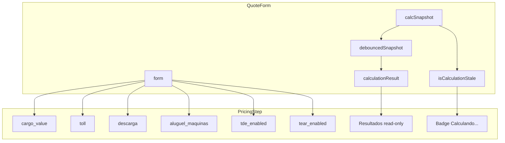

# Passo 3 – Composição Financeira (PricingStep)

## Contexto

O [QuoteFormWizard](src/components/forms/quote-form/QuoteFormWizard.tsx) possui 4 passos; o passo 2 (Composição Financeira) está como placeholder. O conteúdo equivalente existe no fluxo não-wizard de [QuoteForm.tsx](src/components/forms/QuoteForm.tsx) (linhas 1730-2094) e deve ser extraído para `PricingStep.tsx`.

---

## 1. Estrutura do PricingStep

### 1.1 Campos a migrar


| Bloco                 | Campos / Componentes                                                           | Observação                                                                              |
| --------------------- | ------------------------------------------------------------------------------ | --------------------------------------------------------------------------------------- |
| **Valores Base**      | `cargo_value`, `toll`                                                          | Substituir MaskedInput por NumericInput com `prefix="R$ "`                              |
| **Custos Adicionais** | `EquipmentRentalSection` (aluguel_maquinas), `UnloadingCostSection` (descarga) | Manter componentes existentes; estado em QuoteForm                                      |
| **Taxas NTC**         | `tde_enabled`, `tear_enabled`                                                  | Atualmente Checkbox; plano sugere Switch, mas código usa Checkbox — manter consistência |
| **Datas**             | `advance_due_date`, `balance_due_date`                                         | Já existem no schema; migrar inputs type="date"                                         |
| **Resultados**        | Tabs Memória / Rentabilidade                                                   | Read-only, derivados de `calculationResult`                                             |
| **Taxas Adicionais**  | `AdditionalFeesSection`                                                        | Usa `baseFreight`, `cargoValue`, `vehicleTypeId` e `additionalFeesSelection`            |
| **Observações**       | `notes`                                                                        | Textarea                                                                                |


### 1.2 Props do PricingStep

O `PricingStep` precisará receber:

- `form`
- `calculationResult` (read-only)
- `computedConditionalFees`
- `conditionalFeesData`
- `additionalFeesSelection`, `setAdditionalFeesSelection`
- `equipmentRentalItems`, `setEquipmentRentalItems`
- `unloadingCostItems`, `setUnloadingCostItems`
- `formatCurrency`
- `isCalculationStale` (novo: indica recálculo pendente por debounce)
- `taxRegimeSimples`
- `watchedVehicleTypeId`, `watchedCargoValue`

Isso resulta em muitas props. Uma alternativa é agrupar em um objeto `pricingContext` ou expor parte via contexto.

---

## 2. Indicador de Recálculo (Debounce)

`calculationResult` depende de `debouncedSnapshot`. Entre uma alteração do usuário e a estabilização (400ms), os resultados exibidos ficam desatualizados.

**Implementação sugerida:**

```ts
// Em QuoteForm.tsx
const isCalculationStale = calcSnapshot !== debouncedSnapshot;
```

- `true`: dados ainda não estabilizaram
- `false`: `calculationResult` está alinhado com o último snapshot

**Feedback visual:**

1. Opacidade reduzida (ex.: `opacity-70`) no bloco de resultados (Tabs Memória/Rentabilidade) enquanto `isCalculationStale`
2. Badge pequeno: `"Calculando..."` ao lado do total ou da margem
3. Spinner discreto no canto do card (ex.: `Loader2` com `animate-spin`)

Recomendação: combinar opacidade reduzida + badge `"Calculando..."` para ser claro sem poluir o layout.

---

## 3. NumericInput para Valores Monetários

O [NumericInput](src/components/ui/numeric-input.tsx) atual usa `replace(',', '.')` e `parseFloat`. Para valores grandes em pt-BR (ex.: `1.234,56`):

- `"1.234,56"` → `replace(',','.')` → `"1.234.56"` → `parseFloat` → `1.234` ( incorreto)

**Opções:**

- **A)** Manter `MaskedInput` com máscara de moeda para `cargo_value` e `toll` (UX mais adequada para altos valores)
- **B)** Estender `NumericInput` para remover separador de milhares antes do parse: ex. `value.replace(/\./g,'').replace(',','.')` em pt-BR
- **C)** Usar `NumericInput` como está e aceitar entrada sem separador de milhares (ex.: `123456`)

Recomendação: **B** — adicionar lógica de locale em `NumericInput` (ou um `CurrencyNumericInput`) para pt-BR, mantendo o mesmo padrão de `prefix="R$ "` e `onValueChange`.

---

## 4. Sincronização de Pedágio

O pedágio já é preenchido pelo `handleCalculateKm` via Edge Function `calculate-distance-webrouter`:

```755:769:src/components/forms/QuoteForm.tsx
      const toll = Number(data.data?.toll) || 0;
      if (toll > 0) {
        form.setValue('toll', toll, { shouldDirty: true, shouldValidate: true });
      }
```

O `PricingStep` apenas exibe e permite editar `toll`. Garantir:

1. `form.setValue('toll', toll)` no `QuoteForm` (já feito)
2. `NumericInput` controlado por `field.value` para refletir o valor atualizado
3. Não resetar o valor ao trocar de passo

---

## 5. TDE / TEAR

Atualmente são **Checkbox** em [QuoteForm.tsx](src/components/forms/QuoteForm.tsx) (linhas 1815-1837). O plano menciona Switch, mas o código usa Checkbox — manter Checkbox para não alterar o padrão do restante do formulário.

A lógica de `computedConditionalFees` e `calculationResult` já usa `tdeEnabled` e `tearEnabled` via `debounced`; nenhuma mudança adicional necessária.

---

## 6. Visualização Read-Only dos Resultados

O bloco de resultados (Tabs Memória / Rentabilidade) deve:

- Exibir `baseFreight` como "Frete Peso" ou "Frete Base"
- Mostrar breakdown (pedágio, GRIS, TSO, RCTR-C, TDE, TEAR, taxas condicionais, estadia)
- Mostrar Receita Bruta, DAS, ICMS, Total Cliente
- Na aba Rentabilidade: Margem Bruta, Overhead, Resultado Líquido, Margem %

Todo esse bloco vem de `calculationResult` e permanece read-only; basta reutilizar a lógica já presente no QuoteForm.

---

## 7. Diagrama de Fluxo de Dados




---

## 8. Ordem de Implementação Sugerida

1. **Criar `PricingStep.tsx`** — estrutura básica, props e layout em grid.
2. **Migrar valores base** — `cargo_value`, `toll` com `NumericInput` (ou `CurrencyNumericInput` se criado).
3. **Migrar custos adicionais** — `EquipmentRentalSection`, `UnloadingCostSection` (estado permanece em QuoteForm).
4. **Migrar TDE/TEAR** — Checkbox.
5. **Migrar datas** — `advance_due_date`, `balance_due_date`.
6. **Migrar bloco de resultados** — Tabs Memória / Rentabilidade.
7. **Adicionar `AdditionalFeesSection`** — com props corretas.
8. **Adicionar `isCalculationStale`** — em QuoteForm e passar para PricingStep.
9. **Implementar feedback visual** — opacidade + badge "Calculando...".
10. **Integrar no `QuoteFormWizard`** — trocar o placeholder do passo 2 por `PricingStep`.
11. **Ajustar `STEP_FIELDS`** — incluir campos do passo 3 (ex.: `advance_due_date`, `balance_due_date`).

---

## 9. Checklist Resumido

- Sincronização do pedágio: valor vindo da Edge Function preenche o input; edição manual permitida
- TDE/TEAR: Checkbox que acionam recálculo (já via debounce)
- Resultados read-only: exibir `baseFreight` e breakdown de forma clara
- Indicador de recálculo: `isCalculationStale` + opacidade + badge
- NumericInput para moeda: avaliar extensão para pt-BR (separador de milhares)
- Datas: `advance_due_date`, `balance_due_date` no passo de pricing

