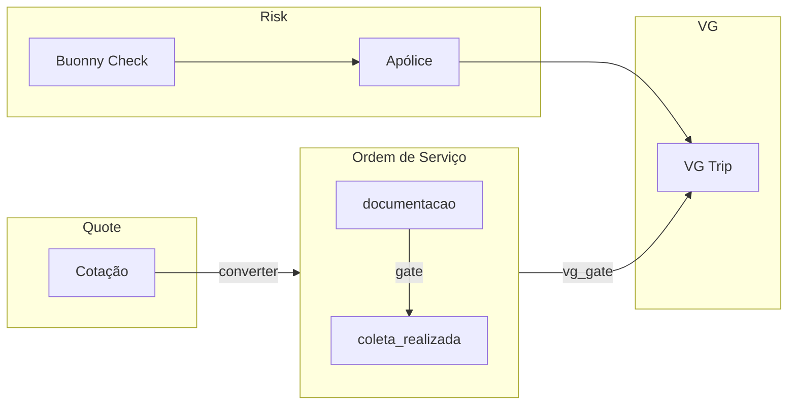

# Plan 04 — Risk Workflow Wizard + Memória de Cálculo (Risco/Seguro) + VG

## Escopo

- **Risk Workflow Wizard**: Buonny + Apólices, com trilha auditável
- **Auditoria/Approval**: gate `documentacao → coleta_realizada` (OS)
- **Memória de Cálculo**: refatoração para incluir Risco/Seguro
- **VG (Trip)**: agregação por OS; soma a partir de Quote quando virar VG

## Key Decisions (não negociáveis)

| Decisão | Valor | Descrição |
|---------|-------|-----------|
| `buonny_code_validity_days` | 90 | Prazo de validade do código Buonny em dias |
| `buonny_source_of_truth` | buonny-check | Endpoint/serviço de referência para validação Buonny |
| `policy_value_reference` | sum_cargo_value | Valor da apólice baseado na soma do valor da carga (cotações/OS) |
| `vg_aggregation_rule` | VG soma por OS | VG é agregado por Ordem de Serviço; origem a partir de Quote quando convertido |

## UI e Gates

- **UI escolhida**: UI-B Risk Workflow Wizard + trilha auditável
- **Gate 1** (`stage_transition`): transição `documentacao → coleta_realizada` (OS)
- **Gate 2** (`vg_gate`): `true` — VG exige condições atendidas

## Dependências

- [Plan 02 v0.2.2](docs/plans/plan-02-metodologia-precificacao-lotacao-vs-fracionado/v0.2.2/methodology.md) — Metodologia de precificação (shape, glossário, Contract)
- [Plan 03 v0.1.1](docs/plans/plan-03-auditoria-ui-mini-cards-vs-motor/v0.1.0/audit.md) — Auditoria UI vs motor (mini-cards, spread R$/km)

## Fluxo (alto nível)

## Referências de código existente

- `quotes.cargo_value` — valor da carga (usado para referência de apólice)
- `orders` — stages e transições
- `trip_orders` — ligação OS ↔ Trip (VG)
- Plan 02: `pricing_breakdown`, `StoredPricingBreakdown`
- Plan 03: métricas UI, `QuoteDetailModal`, `QuoteModalLogisticsGrid`

## Como usar este plano

Ao chamar `@plan-04-risk-workflow-wizard-vg` no prompt:

1. Respeite `key_decisions` (buonny_validity, source_of_truth, policy_value, vg_aggregation)
2. Mantenha gates (`documentacao → coleta_realizada`, `vg_gate`)
3. Use UI-B (Risk Workflow Wizard) e trilha auditável
4. Considere dependências Plan 02 e Plan 03 antes de alterar breakdown/métricas
