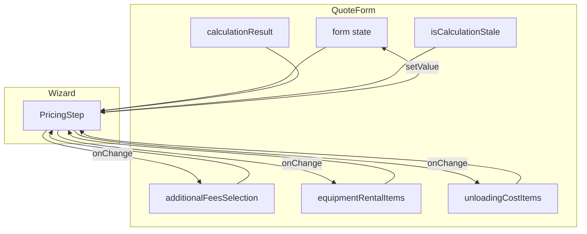

# Avaliação e Plano: PricingStep de Alta Precisão

## Avaliação da Versão Refinada

### Mapeamento — Correto

A versão proposta está **alinhada ao motor de cálculo** (`FreightCalculationOutput` em [src/lib/freightCalculator.ts](src/lib/freightCalculator.ts)):


| Linha UI                                            | Origem                                                                     | Status                       |
| --------------------------------------------------- | -------------------------------------------------------------------------- | ---------------------------- |
| Frete Peso (Base)                                   | `c?.baseFreight`                                                           | OK                           |
| Pedágio                                             | `c?.toll`                                                                  | OK                           |
| Aluguel de Máquinas                                 | `c?.aluguelMaquinas`                                                       | OK                           |
| GRIS, TSO, RCTR-C                                   | `c?.gris`, `c?.tso`, `c?.rctrc`                                            | OK                           |
| TDE/TEAR                                            | `c?.tde`, `c?.tear`                                                        | OK                           |
| Taxas Condicionais                                  | `c?.conditionalFeesTotal`                                                  | OK (antes: `additionalFees`) |
| Estadia                                             | `c?.waitingTimeCost`                                                       | OK (antes: `waitingTime`)    |
| Total Cliente                                       | `t?.totalCliente`                                                          | OK                           |
| Margem Bruta, Overhead, Resultado Líquido, Margem % | `p?.margemBruta`, `p?.overhead`, `p?.resultadoLiquido`, `p?.margemPercent` | OK (antes: em `totals`)      |


### Ajuste Necessário: Estadia vs Descarga

Na fórmula de `receitaBruta` em `freightCalculator.ts` (linhas 658-671), só entram: baseFreight, toll, aluguel, gris, tso, rctrc, tde, tear, dispatchFee, conditionalFeesTotal e **waitingTimeCost**. O `descarga` não faz parte da receita; entra só em `profitability.custosDescarga`.

Portanto, na Memória:

- **Exibir apenas** `c?.waitingTimeCost` como "Estadia" ou "Estadia / Hora Parada".
- **Não somar** `form.watch('descarga')` nessa linha. O descarga é custo interno, não componente da memória de cálculo para o cliente.

Sugestão de código:

```tsx
{c?.waitingTimeCost > 0 && (
  <ResultRow label="Estadia / Hora Parada" value={formatCurrency(c.waitingTimeCost)} />
)}
```

O valor de descarga permanece como entrada no formulário (UnloadingCostSection), mas não deve aparecer somado na linha de Estadia.

### Exibição Condicional

A lógica de exibir só linhas com valor > 0 está adequada. A única linha sempre exibida é "Frete Peso (Base)"; manter assim é coerente, pois é a base do cálculo mesmo quando 0.

### Props e Tipagem

O `PricingStep` proposto não declara interface para as props. Será necessário:

- Criar `PricingStepProps` tipando: `form`, `calculationResult`, `isCalculationStale`, `formatCurrency`, `additionalFeesSelection`, `setAdditionalFeesSelection`, `equipmentRentalItems`, `onEquipmentRentalChange`, `unloadingCostItems`, `onUnloadingCostChange`.
- Importar tipos: `UseFormReturn`, `QuoteFormData`, `FreightCalculationOutput`, `AdditionalFeesSelection`, `EquipmentRentalItem`, `UnloadingCostItem`.

---

## Plano de Implementação

### 1. Criar `src/components/forms/quote-form/steps/PricingStep.tsx`

- Implementar o componente com o conteúdo refinado e a correção de Estadia/Descarga.
- Adicionar interface `PricingStepProps` completa.
- Manter imports de `UnloadingCostSection`, `EquipmentRentalSection`, `AdditionalFeesSection` e demais dependências.

### 2. Atualizar `QuoteFormWizard` e `QuoteForm`

Hoje o step 2 é placeholder. O Wizard não recebe:

- `isCalculationStale`
- `formatCurrency`
- `additionalFeesSelection` / `setAdditionalFeesSelection`
- `equipmentRentalItems` / `onEquipmentRentalChange`
- `unloadingCostItems` / `onUnloadingCostChange`

Ações:

- Em [src/components/forms/QuoteForm.tsx](src/components/forms/QuoteForm.tsx): repassar essas props ao `QuoteFormWizard`.
- Em [src/components/forms/quote-form/QuoteFormWizard.tsx](src/components/forms/quote-form/QuoteFormWizard.tsx): adicionar as novas props na interface e substituir o placeholder do step 2 pelo `PricingStep`.

### 3. Fluxo de Dados




### 4. Resumo das Mudanças por Arquivo


| Arquivo                 | Alterações                                                            |
| ----------------------- | --------------------------------------------------------------------- |
| `steps/PricingStep.tsx` | Novo arquivo com lógica refinada, tipagem e correção Estadia/Descarga |
| `QuoteFormWizard.tsx`   | Novas props, substituir placeholder do step 2 pelo `PricingStep`      |
| `QuoteForm.tsx`         | Passar as props necessárias ao Wizard                                 |


---

## Conclusão

O refinamento proposto está correto em relação ao motor de cálculo, com precisão de mapeamento entre `components`, `totals` e `profitability`. A única alteração recomendada é não incluir `descarga` na linha de Estadia na Memória, mantendo apenas `waitingTimeCost`.