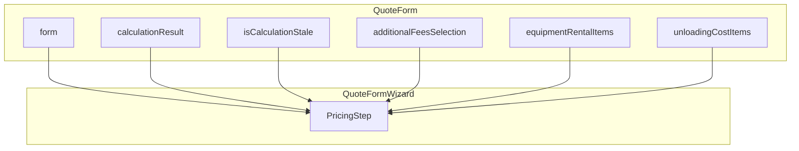

# PricingStep Completo - Plano de Execução

## Resposta à Pergunta

**Sim, os componentes de seção já estão em arquivos separados e prontos para reuso:**


| Componente               | Arquivo                                                                                              | Props principais                                                      |
| ------------------------ | ---------------------------------------------------------------------------------------------------- | --------------------------------------------------------------------- |
| `UnloadingCostSection`   | [src/components/quotes/UnloadingCostSection.tsx](src/components/quotes/UnloadingCostSection.tsx)     | `value`, `onChange(total, items)`, `initialItems`                     |
| `EquipmentRentalSection` | [src/components/quotes/EquipmentRentalSection.tsx](src/components/quotes/EquipmentRentalSection.tsx) | `value`, `onChange(total, items)`, `initialItems`                     |
| `AdditionalFeesSection`  | [src/components/quotes/AdditionalFeesSection.tsx](src/components/quotes/AdditionalFeesSection.tsx)   | `selection`, `onChange`, `baseFreight`, `cargoValue`, `vehicleTypeId` |


Nenhum deles está declarado inline no QuoteForm; são apenas importados e usados. Basta importá-los no PricingStep e passar as props corretas.

---

## Fluxo de Dados




O estado (`additionalFeesSelection`, `equipmentRentalItems`, `unloadingCostItems`) permanece no QuoteForm; o PricingStep recebe via props e chama os handlers passados.

---

## 1. Criar [src/components/forms/quote-form/steps/PricingStep.tsx](src/components/forms/quote-form/steps/PricingStep.tsx)

### 1.1 Props do componente

```ts
interface PricingStepProps {
  form: UseFormReturn<QuoteFormData>;
  calculationResult: FreightCalculationOutput | null;
  isCalculationStale: boolean;
  taxRegimeSimples: number;
  formatCurrency: (v: number) => string;
  // Handlers e estado das seções (passados do QuoteForm)
  additionalFeesSelection: AdditionalFeesSelection;
  setAdditionalFeesSelection: (s: AdditionalFeesSelection) => void;
  equipmentRentalItems: EquipmentRentalItem[];
  setEquipmentRentalItems: (items: EquipmentRentalItem[]) => void;
  unloadingCostItems: UnloadingCostItem[];
  setUnloadingCostItems: (items: UnloadingCostItem[]) => void;
  computedConditionalFees: { ids: string[]; breakdown: Record<string, number> };
  conditionalFeesData: ConditionalFee[] | undefined;
}
```

### 1.2 Layout (2 colunas)

**Coluna A (Esquerda) – Entradas**

- Header com badge "Processando cálculos..." quando `isCalculationStale`
- Valores base: `cargo_value`, `toll` (NumericInput com prefix "R$ ")
- `EquipmentRentalSection` (aluguel de equipamentos)
- `UnloadingCostSection` (chapas / descarga)
- Checkboxes TDE e TEAR
- Datas: `advance_due_date`, `balance_due_date`
- `AdditionalFeesSection` (taxas condicionais e estadia)
- Textarea `notes` (observações)

**Coluna B (Direita) – Resultados**

- Bloco com `opacity-50 grayscale` quando `isCalculationStale`
- Tabs Memória / Rentabilidade (conteúdo extraído de [QuoteForm.tsx linhas 1858–2072](src/components/forms/QuoteForm.tsx))
- Total Cliente em destaque

### 1.3 NumericInput para cargo_value e toll

Usar o NumericInput existente com `prefix="R$ "` e `onValueChange`. Verificar se o NumericInput atual suporta locale pt-BR (parse de 1.500,00); se não, o plano anterior previa ajuste no handleChange.

---

## 2. Atualizar [src/components/forms/quote-form/QuoteFormWizard.tsx](src/components/forms/quote-form/QuoteFormWizard.tsx)

- Adicionar props: `isCalculationStale`, `calculationResult`, `additionalFeesSelection`, `setAdditionalFeesSelection`, `equipmentRentalItems`, `onEquipmentRentalChange`, `unloadingCostItems`, `onUnloadingCostChange`, `computedConditionalFees`, `conditionalFeesData`, `taxRegimeSimples`, `formatCurrency`.
- Substituir o placeholder do step 2 por `<PricingStep ... />`.

---

## 3. Atualizar [src/components/forms/QuoteForm.tsx](src/components/forms/QuoteForm.tsx)

- Passar as novas props para o QuoteFormWizard na chamada do fluxo `USE_WIZARD`.
- Remover o bloco não-wizard (ou mantê-lo comentado) que contém EquipmentRentalSection, UnloadingCostSection, TDE/TEAR, Tabs e AdditionalFeesSection (linhas ~1730–2112), pois esse conteúdo passará a viver só no PricingStep.

---

## 4. Extração do bloco Tabs

O bloco de Tabs (Memória / Rentabilidade) em QuoteForm tem ~210 linhas de JSX. Estratégia:

- **Opção A:** Manter o JSX dentro do PricingStep (copiar do QuoteForm e adaptar props). Simples, mas o PricingStep fica grande.
- **Opção B:** Extrair para um subcomponente `PricingResultsTabs` em `steps/PricingResultsTabs.tsx` recebendo `calculationResult`, `computedConditionalFees`, `conditionalFeesData`, `additionalFeesSelection`, `taxRegimeSimples`, `formatCurrency`.

Recomendação: **Opção A** na primeira versão; refatorar para Opção B depois se o arquivo ficar grande demais.

---

## 5. Checklist de Validação

- Cargo_value e toll editáveis e refletidos no cálculo
- EquipmentRentalSection (Empilhadeira, Munck, Paleteira) visível e funcional
- UnloadingCostSection (Chapas) visível e funcional
- TDE/TEAR alteram o breakdown
- AdditionalFeesSection (taxas condicionais, estadia) visível e funcional
- Tabs Memória e Rentabilidade exibem valores corretos
- Badge "Processando cálculos..." aparece durante o debounce
- Datas advance_due_date e balance_due_date editáveis
- STEP_FIELDS[2] inclui os campos do pricing para validação ao avançar

