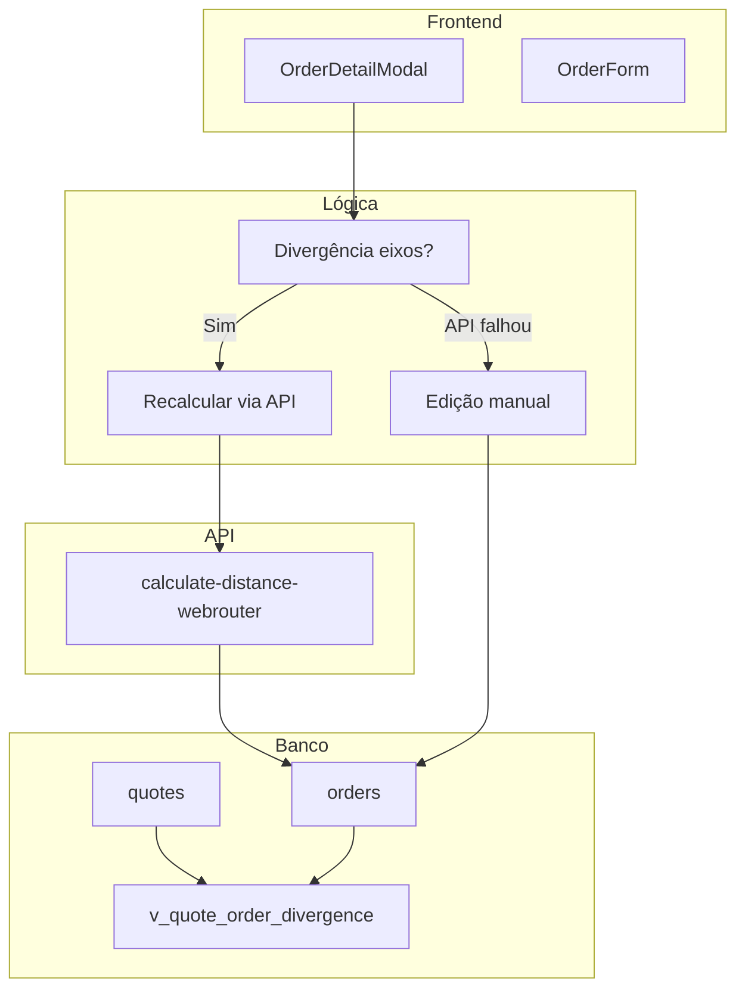

# Plano: Pedágio na OS, Divergência de Eixos e Auditoria Cotação vs OS

## Contexto

O pedágio é calculado na cotação via `calculate-distance-webrouter` com `axes_count` do veículo selecionado. Na conversão para OS, `toll_value` e `pricing_breakdown` são clonados. A OS pode receber outro veículo com eixos diferentes; o pedágio clonado fica incorreto. É necessário recálculo, edição manual como fallback e relatório de auditoria para fins financeiros.

## Visão Geral do Plano

---

## Parte 1: Indicador Visual e Recálculo de Pedágio

### 1.1 Detecção de Divergência de Eixos

**Arquivo**: [src/components/modals/OrderDetailModal.tsx](src/components/modals/OrderDetailModal.tsx)

- **Eixos da cotação**: `order?.quote?.vehicle_type?.axes_count` ou `savedAntt?.axesCount`
- **Eixos da OS**: `order?.vehicle_type?.axes_count`
- **Condição**: `axesDivergence = (quoteAxes != null && orderAxes != null && quoteAxes !== orderAxes)`

### 1.2 Indicador Visual

Na aba **Pedágios** do OrderDetailModal (ou no cabeçalho da seção), exibir:

- Alerta quando `axesDivergence`: "O veículo da OS tem X eixos; a cotação usou Y eixos. O pedágio pode estar incorreto."
- Botão **Recalcular pedágio** (só visível quando `canManage` e há CEPs)

### 1.3 Função de Recálculo

- Invocar `supabase.functions.invoke('calculate-distance-webrouter', { body: { origin_cep, destination_cep, axes_count: orderAxes } })`
- CEPs: `order.origin_cep ?? order.quote?.origin_cep` e `order.destination_cep ?? order.quote?.destination_cep`
- Se CEPs ausentes: desabilitar botão e exibir mensagem "Preencha CEPs para recalcular"

**Atualizações ao salvar**:

- `order.toll_value` = novo `toll` retornado
- `order.pricing_breakdown` = merge: `meta.tollPlazas`, `meta.antt.axesCount` (se existir), `components.toll`

**Referência**: [src/components/forms/QuoteForm.tsx](src/components/forms/QuoteForm.tsx) linhas 643–701 (handleCalculateKm)

---

## Parte 2: Edição Manual (Fallback)

### 2.1 Onde Incluir

Opção A: Seção "Valor do pedágio" na aba **Pedágios** do OrderDetailModal (recomendado — contexto próximo).

Opção B: Campo `toll_value` no OrderForm (exige carregar e repassar pricing_breakdown para orders vindas de cotação).

### 2.2 Implementação

- Input numérico para `toll_value` (R$)
- Ao salvar: `useUpdateOrder` com `{ toll_value, pricing_breakdown }`
- Atualizar `pricing_breakdown.components.toll` com o valor digitado
- `meta.tollPlazas`: manter como está ou limpar (decisão de UX — manter permite auditoria do que foi alterado)

### 2.3 Schema

`OrderUpdate` já aceita `toll_value` e `pricing_breakdown` (tipos do Supabase). Nenhuma alteração de schema necessária.

---

## Parte 3: View de Auditoria

### 3.1 Migration SQL

**Arquivo**: `supabase/migrations/YYYYMMDDHHMMSS_quote_order_divergence_audit_view.sql`

- `JOIN` orders com quotes em `order.quote_id = quote.id`
- `LEFT JOIN` vehicle_types (quote e order) para `axes_count`
- Colunas de comparação: `quote_value`, `order_value`, `delta_value`, `quote_toll_value`, `order_toll_value`, `delta_toll`, `quote_km`, `order_km`, `delta_km`, `quote_axes_count`, `order_axes_count`, `axes_divergence`
- `margem_percent_prevista` extraída de `pricing_breakdown.profitability`
- View read-only; sem alterar tabelas nem lógica dos agentes

### 3.2 Colunas da View (resumo)

| Coluna                                         | Tipo      | Descrição                          |
| ---------------------------------------------- | --------- | ---------------------------------- |
| order_id, quote_id, os_number, quote_code      | uuid/text | IDs e códigos                      |
| client_name, origin, destination               | text      | Rota                               |
| quote_value, order_value, delta_value          | numeric   | Valores                            |
| quote_toll_value, order_toll_value, delta_toll | numeric   | Pedágio                            |
| quote_km, order_km, delta_km                   | numeric   | Distância                          |
| quote_axes_count, order_axes_count             | integer   | Eixos                              |
| axes_divergence                                | boolean   | true quando eixos diferentes       |
| margem_percent_prevista                        | numeric   | De pricing_breakdown.profitability |
| order_stage, order_created_at                  | -         | Metadados                          |

---

## Parte 4: Impacto no Valor do Frete

**Decisão**: Não alterar `order.value` automaticamente ao recalcular/editar `toll_value`.

- O `order.value` representa o valor acordado com o cliente; mudanças de pedágio podem ou não refletir no contrato.
- O `pricing_breakdown.totals.totalCliente` também não será alterado automaticamente.
- Documentar no código ou em docs que o impacto em margem/rentabilidade deve ser avaliado manualmente ou em futura feature de recálculo de margem.

---

## Verificação de Impacto nos Agentes

| Agente                         | Leitura                 | Impacto                                |
| ------------------------------ | ----------------------- | -------------------------------------- |
| quoteProfitabilityWorker       | quotes, orders          | Nenhum — continuam lendo tabelas       |
| financialAnomalyWorker         | quotes, orders          | Nenhum                                 |
| complianceCheckWorker          | order, quote            | Nenhum                                 |
| operationalInsightsWorker      | orders                  | Nenhum                                 |
| approvalSummaryWorker          | quotes, orders          | Nenhum                                 |
| dashboardInsightsWorker        | quotes, orders          | Nenhum                                 |
| sync_cost_items_from_breakdown | order.pricing_breakdown | Beneficiado — usa breakdown atualizado |

---

## Ordem de Implementação Sugerida

1. **Migration** `v_quote_order_divergence` (sem dependências)
2. **Indicador visual** de divergência de eixos no OrderDetailModal
3. **Botão Recalcular pedágio** + lógica de chamada à API e atualização da order
4. **Edição manual** de `toll_value` na aba Pedágios
5. Documentação sobre impacto no `order.value` (avaliação posterior)

