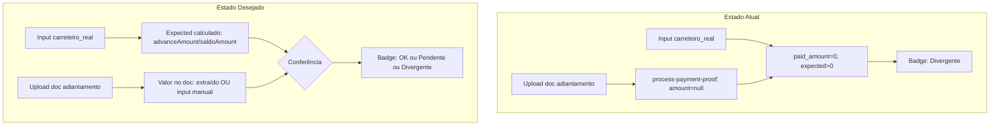

# Plano: Reconciliação Carreteiro, Valor Esperado e Auditoria

## Contexto do Problema

Hoje a conciliação está invertida:

- O usuário faz upload de comprovante (adiantamento/saldo) e informa `carreteiro_real`
- `process-payment-proof` cria `payment_proof` com `amount: null` (não há extração do documento)
- A view `v_order_payment_reconciliation` calcula `paid_amount = SUM(payment_proofs.amount)` → sempre 0
- Como `paid_amount = 0` e `expected_amount = carreteiro_real > 0`, `is_reconciled = false`
- O badge mostra "Divergente" mesmo quando documento e valor estão preenchidos

O correto seria: **documento anexado + valor do carreteiro informado** = situação aceitável para auditoria, não "Divergente". "Divergente" deve ocorrer apenas quando há incompatibilidade explícita entre valor esperado e valor declarado/lido.

---

## Fluxo Atual vs Desejado




---

## Parte 1: Correção da Lógica do Badge

**Arquivos**: [CarreteiroTab.tsx](src/components/modals/CarreteiroTab.tsx), [FinancialCard.tsx](src/components/financial/FinancialCard.tsx), [OrderDetailModal.tsx](src/components/modals/OrderDetailModal.tsx)

**Problema**: Hoje o badge é "Divergente" sempre que `!is_reconciled` e `proofs_count > 0`. Isso inclui o caso em que o usuário anexou o documento e informou o valor, mas o sistema não tem `amount` preenchido.

**Solução**: Tratar três estados distintos:


| Condição                                                            | Badge                | Significado                                                             |
| ------------------------------------------------------------------- | -------------------- | ----------------------------------------------------------------------- |
| `is_reconciled`                                                     | Conciliado           | Soma dos amounts dos proofs ≈ valor esperado                            |
| `proofs_count > 0` e todos `amount` null e `carreteiro_real > 0`    | Pendente confirmação | Documento anexado, valor informado; falta conferir valor do comprovante |
| `proofs_count > 0` e algum `amount` preenchido e delta > tolerância | Divergente           | Incompatibilidade entre esperado e declarado                            |
| `proofs_count = 0` e `expected > 0`                                 | Pendente             | Ainda não há comprovante                                                |


A view atual não expõe "todos amount null" diretamente. Duas opções:

1. **Opção A (simples)**: Adicionar coluna na view `has_proofs_without_amount boolean` (existe proof com amount null)
2. **Opção B (frontend)**: O hook `useOrderReconciliation` já retorna `proofs_count`. Criar `usePaymentProofsByOrder` para checar se há proofs com `amount` null. Usar no componente.

Recomendação: **Opção B** — usar dados existentes de `payment_proofs` no frontend para decidir o badge, sem alterar a view. Se `proofs_count > 0`, `paid_amount = 0` e `expected_amount > 0` → "Pendente confirmação" em vez de "Divergente".

**Alteração** em `CarreteiroTab.tsx` (linhas 516–534):

```tsx
// Hoje:
} : reconciliation.proofs_count > 0 ? (
  <span>Divergente</span>
) : (

// Proposto: considerar "Pendente confirmação" quando tem proof mas paid=0
} : reconciliation.proofs_count > 0 && reconciliation.paid_amount === 0 && Number(reconciliation.expected_amount) > 0 ? (
  <span>Pendente confirmação</span>
) : reconciliation.proofs_count > 0 ? (
  <span>Divergente</span>
) : (
```

Idem para `FinancialCard.tsx` e demais pontos que exibem o badge.

---

## Parte 2: Cálculo Automático do Valor Esperado por Tipo

**Contexto**: A condição de pagamento (`carrier_payment_term`) define `advance_percent`. O valor esperado para adiantamento é `carreteiro_real * advance_percent / 100`, e para saldo é `carreteiro_real * (100 - advance_percent) / 100`.

**Arquivos**: Nova view ou extensão da view, [process-payment-proof](supabase/functions/process-payment-proof/index.ts)

**Atual**: `v_order_payment_reconciliation` usa `expected_amount = carreteiro_real` (total). A comparação é soma dos proofs vs total, o que está correto semanticamente.

**Melhoria**: Para auditoria e para exibir "esperado por proof", é útil ter o valor esperado por tipo. Duas abordagens:

1. **Na view**: Manter `expected_amount` total. Adicionar colunas opcionais `expected_advance`, `expected_balance` quando houver `carrier_payment_term_id` e `carrier_advance_percent`.
2. **No process-payment-proof**: Ao criar o proof, buscar a order com `carrier_payment_term` e preencher um campo `expected_amount` no `payment_proof` (ou em `extracted_fields`) para uso em auditoria.

A estrutura atual de `payment_proofs` não tem `expected_amount`. O plano [trips_prd_implementation](.cursor/plans/trips_prd_implementation_437bede4.plan.md) prevê isso como evolução.

**Ação**:

- Migration: adicionar coluna `payment_proofs.expected_amount numeric` (opcional)
- Em `process-payment-proof`: ao criar o proof, buscar `orders` com `carrier_payment_term_id` e `payment_terms.advance_percent`, calcular `expected_amount` por tipo (adiantamento vs saldo) e gravar

---

## Parte 3: Preenchimento do Valor do Comprovante

**Problema**: `amount` em `payment_proofs` nunca é preenchido. Não há extração automática nem input manual.

**Caminhos**:

### 3.1 Input manual (MVP)

- Adicionar UI para editar `payment_proof.amount` na lista de comprovantes da OS
- Em `DocumentList` ou em componente dedicado na aba Carreteiro: para documentos `adiantamento_carreteiro` / `saldo_carreteiro`, exibir campo de valor e botão Salvar
- Endpoint: RPC ou mutation via Supabase `update payment_proofs set amount = ? where id = ?`
- Após salvar, invalidar `reconciliation` e `payment_proofs`

### 3.2 Extração via IA (fase posterior)

- Edge Function: receber `documentId`, baixar arquivo do storage, usar Vision/OCR (ex.: `callLLM` com modelo com visão) para extrair valor
- Gravar em `amount`, `extracted_fields`, `extraction_confidence`
- Fallback: se extração falhar ou confiança baixa, manter `amount` null e permitir input manual

O [selecao-llm-trips-v2](.cursor/plans/selecao-llm-trips-v2-fases1-4_56a430aa.plan.md) já indica uso de IA para extração no futuro. Para este plano, priorizar input manual.

---

## Parte 4: Integração com complianceCheckWorker

**Arquivo**: [complianceCheckWorker.ts](supabase/functions/_shared/workers/complianceCheckWorker.ts)

**Estado atual**: O worker avalia CNH, CRLV, NF-e, CT-e, piso ANTT etc., mas não considera comprovantes de pagamento ao carreteiro.

**Proposta**: Incluir regra de auditoria para "Comprovante de pagamento ao carreteiro conciliado".

Fluxo:

1. No contexto do order, buscar `payment_proofs` e dados de reconciliação (ou `v_order_payment_reconciliation`)
2. Nova regra (ex.: em `evaluatePreEntrega` ou em `auditoria_periodica`):
  - Se `carreteiro_real > 0` e não há proof → `passed: false`, "Comprovante de pagamento ausente"
  - Se há proof(s) e `is_reconciled` → `passed: true`
  - Se há proof(s), `amount` preenchido e delta > tolerância → `passed: false`, "Divergência entre valor esperado e valor do comprovante"
  - Se há proof(s) mas todos `amount` null → `passed: false` com severidade menor, "Comprovante anexado, valor a confirmar"

Para isso, o `orderData` enviado ao worker precisa incluir `payment_proofs` e/ou `reconciliation`. Verificar onde `executeComplianceCheckWorker` é chamado e enriquecer o payload.

---

## Resumo de Alterações por Arquivo


| Arquivo                          | Alteração                                                                               |
| -------------------------------- | --------------------------------------------------------------------------------------- |
| `CarreteiroTab.tsx`              | Ajustar lógica do badge: "Pendente confirmação" quando proof existe, paid=0, expected>0 |
| `FinancialCard.tsx`              | Mesma lógica de badge                                                                   |
| `OrderDetailModal.tsx`           | Idem, se houver badge de reconciliação                                                  |
| Migration                        | Coluna opcional `payment_proofs.expected_amount`                                        |
| `process-payment-proof/index.ts` | Calcular e gravar `expected_amount` ao criar proof                                      |
| DocumentList ou novo componente  | UI para editar `payment_proof.amount` (adiantamento/saldo)                              |
| RPC ou policy                    | Permitir `update` em `payment_proofs.amount`                                            |
| `complianceCheckWorker.ts`       | Nova regra "Comprovante de pagamento conciliado" com acesso a proofs/reconciliation     |
| Chamada ao compliance worker     | Incluir `payment_proofs` e reconciliation no `orderData`                                |


---

## Ordem de Implementação Sugerida

1. **Correção do badge** — impacto imediato, sem mudança de schema
2. **UI de input manual do amount** — habilita reconciliação real
3. **Expected amount no proof** — melhora auditoria e futura extração
4. **Regra no complianceCheckWorker** — completa o ciclo de auditoria
5. **Extração automática** — evolução futura (OCR/IA)

