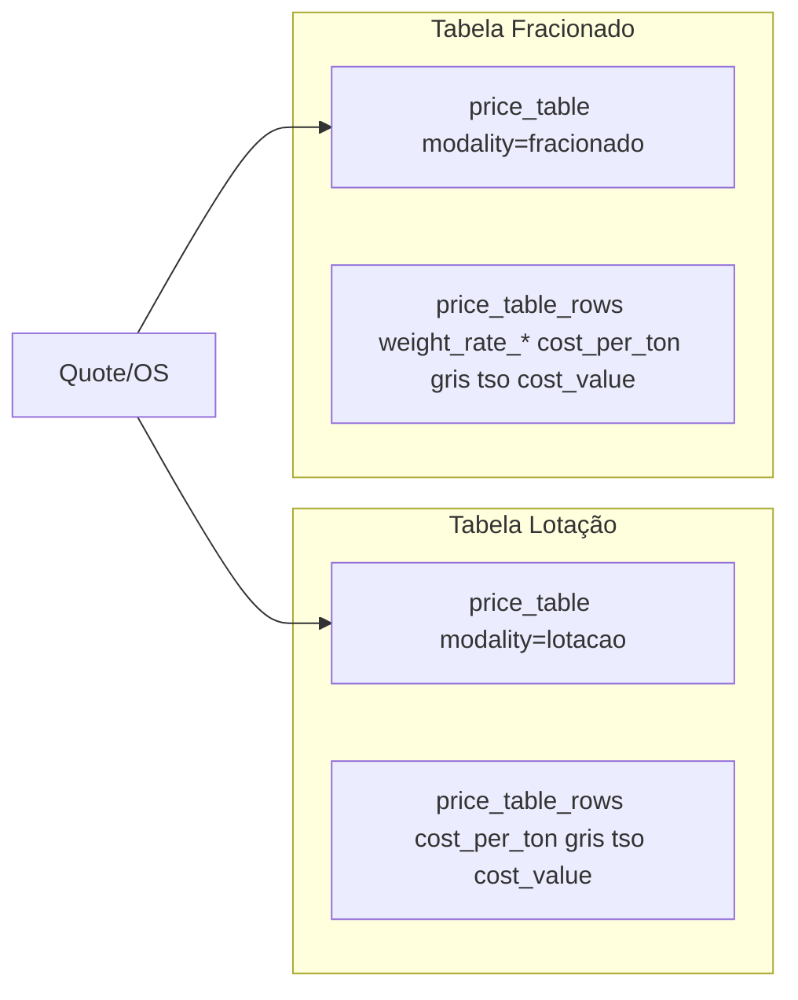

# Plano: Correção price_table_rows — Lotação e Fracionado

## Contexto

Duas tabelas distintas com dados incorretos no banco:

- **Lotação** (1ª imagem): cost_per_ton, st_value_perc, gris_percent, so_percent — valores atuais no CSV estão errados (ex.: 123,74 vs 226,04 para 1–50 km)
- **Fracionado** (2ª imagem): faixas de peso em R$/kg, R$/t, Custo Valo TSO (%), GRIS (%) — lógica e dados precisam ser ajustados

---

## 1. Lotação — Corrigir Dados

### Discrepância atual

| Faixa        | CSV atual (errado)  | Planilha correta (1ª img) |
| ------------ | ------------------- | ------------------------- |
| 1-50 km      | cost_per_ton 123,74 | 226,04                    |
| 5801-6000 km | 2.862,90            | 4.950,85                  |

### Mapeamento da planilha lotação (1ª imagem)

| Coluna planilha | price_table_rows   | Observação                |
| --------------- | ------------------ | ------------------------- |
| km_from, km_to  | km_from, km_to     | Faixas 1-50 até 5801-6000 |
| cost_per_ton    | cost_per_ton       | R$ 226,04 a R$ 4.950,85   |
| st_value_perc   | cost_value_percent | 0,30% a 1,20%             |
| gris_percent    | gris_percent       | 0,30 fixo                 |
| so_percent      | tso_percent        | 0,15% a 0,30%             |

### Ajuste no cálculo (lotação)

O [calculate-freight](supabase/functions/calculate-freight/index.ts) hoje força `costValuePercent = 0` para lotação (linha 358). Com a planilha correta, `st_value_perc` deve entrar no cálculo:

- **Proposta**: Usar `cost_value_percent` da linha quando existir (RCTR-C / Custo Valor).
- **Frete valor**: `cargo_value × cost_value_percent`.

### Arquivos e ações

- **Novo CSV**: [data/ntc/ntc_lotacao_dez25_price_table_rows.csv](data/ntc/ntc_lotacao_dez25_price_table_rows.csv) — substituir pelos valores da 1ª imagem
- **Migration ou script**: Atualizar linhas da tabela lotação no banco
- **Backend**: [supabase/functions/calculate-freight/index.ts](supabase/functions/calculate-freight/index.ts) — remover `costValuePercent = 0` e usar `Number(priceRow.cost_value_percent) || 0`
- **Frontend**: [src/lib/freightCalculator.ts](src/lib/freightCalculator.ts) — lotação: incluir `costValuePercent` da linha no cálculo (se já não for feito)

---

## 2. Fracionado — Lógica e Dados

### Lógica atual vs desejada

| Aspecto        | Atual             | Nova (2ª imagem)         |
| -------------- | ----------------- | ------------------------ |
| Faixas ≤200 kg | Valor fixo R$/CTe | `peso × R$/kg`           |
| Faixa >200 kg  | `peso × R$/kg`    | Idem                     |
| GRIS           | De ltl_parameters | Da linha (0,30%)         |
| Custo Valo TSO | Da linha          | Da linha (0,30% a 1,20%) |

### Mapeamento da planilha fracionado (2ª imagem)

| Planilha                   | price_table_rows                         |
| -------------------------- | ---------------------------------------- |
| De_km, Ate_km              | km_from, km_to                           |
| R$/t                       | cost_per_ton                             |
| de 1 a 10 k … de 151 a 200 | weight_rate_10 … weight_rate_200 (R$/kg) |
| R$/kg acim                 | weight_rate_above_200                    |
| Custo Valo TSO (%)         | cost_value_percent ou tso_percent        |
| GRIS (%)                   | gris_percent                             |

### Arquivos a alterar

- [src/lib/freightCalculator.ts](src/lib/freightCalculator.ts): faixas ≤200 kg → `baseCost = billableWeightKg × ratePerKg`
- [supabase/functions/calculate-freight/index.ts](supabase/functions/calculate-freight/index.ts): mesma lógica + GRIS/TSO da linha
- [src/lib/priceTableParser.ts](src/lib/priceTableParser.ts): aliases para colunas da planilha fracionada
- **Novo CSV**: Criar `data/ntc/ntc_fracionado_dez25_price_table_rows.csv` com os 60 registros da 2ª imagem

---

## 3. Estrutura no Banco

### Duas price_tables

- **Lotação**: `price_tables.modality = 'lotacao'` → `price_table_rows` só com `cost_per_ton`, `cost_value_percent`, `gris_percent`, `tso_percent`
- **Fracionado**: `price_tables.modality = 'fracionado'` → `price_table_rows` com `weight_rate`_*, `cost_value_percent`, `gris_percent`, `tso_percent`, `cost_per_ton`

### Fluxo de dados

---

## 4. Ordem de Implementação

1. **Lotação**
  - Gerar CSV com valores da 1ª imagem  
  - Atualizar `ntc_lotacao_dez25_price_table_rows.csv`  
  - Ajustar `calculate-freight` para usar `cost_value_percent` em lotação  
  - Importar/replicar dados no banco
2. **Fracionado**
  - Gerar CSV com valores da 2ª imagem  
  - Alterar lógica para `peso × R$/kg` em todas as faixas  
  - Adicionar aliases no parser  
  - Criar tabela fracionada e importar
3. **Margem** (opcional)
  - Ajustar [QuoteDetailModal](src/components/modals/QuoteDetailModal.tsx) para usar custo real em vez de piso ANTT na margem exibida

---

## 5. Conferência dos Valores

### Lotação — amostra (1ª imagem)

- 1–50 km: cost_per_ton 226,04 | st 0,30 | gris 0,30 | so 0,15  
- 251–300 km: cost_per_ton 238,84 | st 0,40 | gris 0,30 | so 0,17  
- 3401–3600 km: cost_per_ton 1.758,03 | st 1,20 | gris 0,30 | so 0,30  
- 5801–6000 km: cost_per_ton 4.950,85 | st 1,20 | gris 0,30 | so 0,30

### Fracionado — amostra (2ª imagem)

- 1–50 km: R$/t 940,91 | 1–10 kg: 32,93 | R$/kg acim: 0,9409 | Custo Valo TSO 0,30% | GRIS 0,30%  
- 5801–6000 km: R$/t 6.067,08 | 1–10 kg: 212,35 | R$/kg acim: 6,0671 | Custo Valo TSO 1,20% | GRIS 0,30%

