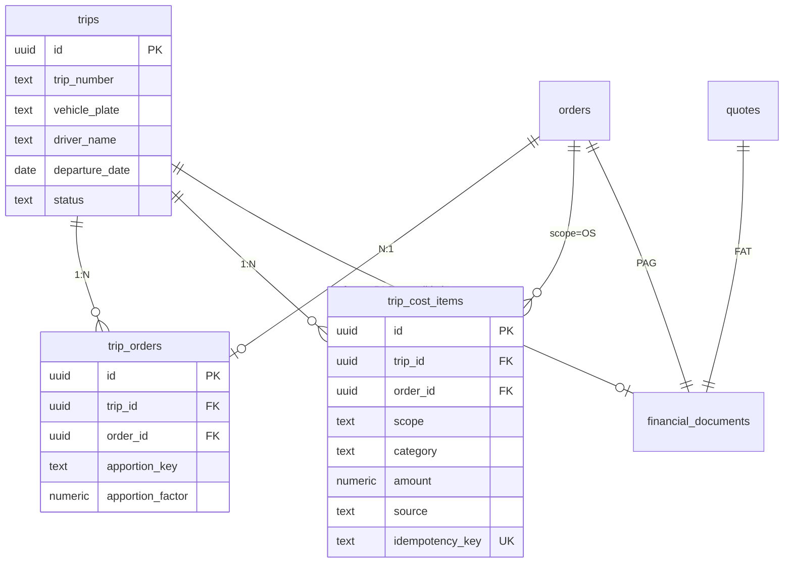

# Plano Tecnico: Viagem (Trip) — Agrupamento de OS por Caminhao

## 1. Resumo

Hoje o sistema opera 1:1 (Quote -> Order -> FAT/PAG). Quando duas OS compartilham o mesmo caminhao, cada uma aparece isolada no Board Financeiro, impossibilitando analise de margem real da viagem. Alem disso, custos calculados no Board Comercial (`pricing_breakdown` JSONB) nao sao exibidos no modal financeiro de forma detalhada.

Este plano introduz a entidade `**trips**` (Viagem) que agrupa N ordens no mesmo veiculo/motorista, cria uma tabela de itens de custo explicitos (`trip_cost_items`), define regras de rateio, e adapta o Board Financeiro para visao consolidada e por OS.

---

## 2. Modelo de Dados

### 2.1 Nova tabela: `trips`

```sql
CREATE TABLE public.trips (
  id            UUID PRIMARY KEY DEFAULT gen_random_uuid(),
  trip_number   TEXT NOT NULL UNIQUE,
  vehicle_plate TEXT NOT NULL,
  driver_name   TEXT,
  driver_phone  TEXT,
  vehicle_type_id UUID REFERENCES public.vehicle_types(id),
  departure_date DATE,
  status        TEXT NOT NULL DEFAULT 'aberta'
                  CHECK (status IN ('aberta','em_transito','finalizada','cancelada')),
  notes         TEXT,
  created_by    UUID NOT NULL REFERENCES public.valid_users(id),
  created_at    TIMESTAMPTZ NOT NULL DEFAULT now(),
  updated_at    TIMESTAMPTZ NOT NULL DEFAULT now()
);
```

Campos-chave:

- `vehicle_plate` + `departure_date` = chave natural para deteccao automatica
- `trip_number` = gerado via RPC `generate_trip_number()` (ex: `VG-2026-03-0001`)
- `status` = ciclo de vida da viagem

### 2.2 Nova tabela de juncao: `trip_orders`

```sql
CREATE TABLE public.trip_orders (
  id               UUID PRIMARY KEY DEFAULT gen_random_uuid(),
  trip_id          UUID NOT NULL REFERENCES public.trips(id) ON DELETE CASCADE,
  order_id         UUID NOT NULL REFERENCES public.orders(id),
  apportion_key    TEXT NOT NULL DEFAULT 'revenue'
                     CHECK (apportion_key IN ('revenue','weight','volume','km','equal','manual')),
  apportion_factor NUMERIC NOT NULL DEFAULT 0,
  manual_percent   NUMERIC,
  created_at       TIMESTAMPTZ NOT NULL DEFAULT now(),
  UNIQUE (trip_id, order_id)
);
```

Campos-chave:

- `apportion_key` = criterio de rateio (padrao: `revenue`)
- `apportion_factor` = fator calculado (ex: 0.2059 para 20.59%)
- `manual_percent` = override manual (quando `apportion_key = 'manual'`)
- Constraint UNIQUE impede duplicar uma OS na mesma viagem

### 2.3 Nova tabela: `trip_cost_items`

```sql
CREATE TABLE public.trip_cost_items (
  id            UUID PRIMARY KEY DEFAULT gen_random_uuid(),
  trip_id       UUID NOT NULL REFERENCES public.trips(id) ON DELETE CASCADE,
  order_id      UUID REFERENCES public.orders(id),
  scope         TEXT NOT NULL CHECK (scope IN ('TRIP','OS')),
  category      TEXT NOT NULL CHECK (category IN (
    'pedagio','carreteiro','descarga','carga','das','icms',
    'gris','tso','seguro','overhead','combustivel','diaria',
    'manutencao','outros'
  )),
  description   TEXT,
  amount        NUMERIC NOT NULL DEFAULT 0,
  currency      TEXT NOT NULL DEFAULT 'BRL',
  source        TEXT NOT NULL DEFAULT 'manual'
                  CHECK (source IN ('breakdown','manual','api')),
  reference_id  UUID,
  idempotency_key TEXT UNIQUE,
  created_at    TIMESTAMPTZ NOT NULL DEFAULT now()
);
```

Campos-chave:

- `scope = 'TRIP'`: custo compartilhado (pedagio, carreteiro, combustivel) — sera rateado
- `scope = 'OS'`: custo especifico de uma OS (descarga no destino X) — `order_id` obrigatorio
- `source = 'breakdown'`: veio do `pricing_breakdown` da quote/order
- `idempotency_key`: evita duplicacao em reprocessamento (ex: `trip_{id}_pedagio_breakdown`)

### 2.4 Coluna nova em `orders`

```sql
ALTER TABLE public.orders ADD COLUMN trip_id UUID REFERENCES public.trips(id);
```

Permite buscar rapidamente a viagem de uma OS e exibir no card/modal.

### 2.5 Diagrama ER




---

## 3. Eventos e Gatilhos

### 3.1 Mecanismo padrao: `vehicle_plate + departure_date`

**Quando**: ao mover OS para stage `coleta_realizada` (confirmacao de coleta).

**Pipeline**:

1. Trigger ou hook detecta `orders.stage = 'coleta_realizada'` com `vehicle_plate` preenchido
2. Busca trip existente com mesma `vehicle_plate` e `departure_date = CURRENT_DATE` e `status = 'aberta'`
3. Se encontra: adiciona a OS via `trip_orders` + recalcula fatores de rateio
4. Se nao encontra: cria nova `trip` e vincula a OS
5. Executa `sync_cost_items_from_breakdown(trip_id)` para popular `trip_cost_items` a partir dos `pricing_breakdown` das OS vinculadas

**Alternativa manual**: botao "Criar/Vincular Viagem" no Board Operacional (para agrupar OS de datas diferentes ou corrigir agrupamento).

### 3.2 Desagrupamento

- Remover registro de `trip_orders` + recalcular fatores restantes
- Se trip fica sem OS: marcar `status = 'cancelada'`
- Limpar `orders.trip_id`

### 3.3 Idempotencia

- `trip_orders` tem constraint UNIQUE em `(trip_id, order_id)`
- `trip_cost_items` usa `idempotency_key` para evitar duplicacao
- Formato da key: `{trip_id}_{order_id}_{category}_{source}` (ex: `abc123_def456_pedagio_breakdown`)

---

## 4. Regras de Rateio

### 4.1 Regra padrao: por Receita (revenue)

**Justificativa**: proporcional ao valor de cada OS no faturamento total. E o criterio mais justo para transportadoras pois OS de maior valor arcam com maior parcela dos custos compartilhados.

**Formula**:

```
fator_OS_i = OS_i.value / SUM(OS_j.value para j em trip_orders)
```

**Exemplo com 2 OS**:

- OS A: R$ 2.887,65 -> fator = 2.887,65 / 14.020,87 = 0,2059 (20,59%)
- OS B: R$ 11.133,22 -> fator = 11.133,22 / 14.020,87 = 0,7941 (79,41%)

### 4.2 Alternativas (configuráveis por trip)


| Criterio | Formula                               | Quando usar                           |
| -------- | ------------------------------------- | ------------------------------------- |
| `weight` | `OS_i.weight / SUM(weight)`           | Carga a granel, commodities           |
| `volume` | `OS_i.volume / SUM(volume)`           | Carga volumosa (moveis, eletronicos)  |
| `km`     | `OS_i.km_distance / SUM(km_distance)` | Entregas em pontos diferentes da rota |
| `equal`  | `1 / N`                               | Entregas similares                    |
| `manual` | `manual_percent / 100`                | Override comercial                    |


### 4.3 Tratamento por tipo de custo


| Tipo de custo          | Escopo | Rateio                                    |
| ---------------------- | ------ | ----------------------------------------- |
| Pedagio                | TRIP   | Rateado entre OS pelo fator               |
| Carreteiro (ANTT/real) | TRIP   | Rateado entre OS pelo fator               |
| Combustivel            | TRIP   | Rateado entre OS pelo fator               |
| Diaria motorista       | TRIP   | Rateado entre OS pelo fator               |
| Descarga               | OS     | 100% atribuido a OS especifica            |
| Carga                  | OS     | 100% atribuido a OS especifica            |
| DAS                    | OS     | Calculado sobre receita individual da OS  |
| ICMS                   | OS     | Calculado sobre receita individual da OS  |
| GRIS/TSO               | OS     | Calculado sobre valor da carga individual |


---

## 5. Calculo Financeiro

### 5.1 Formulas - Consolidado por Viagem (Trip)

```
Receita_Bruta_Trip   = SUM(OS_i.value)
Custos_TRIP          = SUM(trip_cost_items WHERE scope='TRIP')
Custos_OS_Total      = SUM(trip_cost_items WHERE scope='OS')
Custos_Diretos_Trip  = Custos_TRIP + Custos_OS_Total
Impostos_Trip        = SUM(OS_i.pricing_breakdown.totals.das + icms)
Margem_Bruta_Trip    = Receita_Bruta_Trip - Impostos_Trip - Custos_Diretos_Trip
Overhead_Trip        = Margem_Bruta_Trip * overhead_percent (default 10%)
Resultado_Liq_Trip   = Margem_Bruta_Trip - Overhead_Trip
Margem_Percent_Trip  = (Resultado_Liq_Trip / Receita_Bruta_Trip) * 100
```

### 5.2 Formulas - Por OS (com rateio)

```
Receita_OS           = OS.value
Custos_TRIP_Rateado  = SUM(trip_cost_items WHERE scope='TRIP') * apportion_factor
Custos_OS_Proprio    = SUM(trip_cost_items WHERE scope='OS' AND order_id=OS.id)
Custos_Diretos_OS    = Custos_TRIP_Rateado + Custos_OS_Proprio
Impostos_OS          = OS.pricing_breakdown.totals.das + icms
Margem_Bruta_OS      = Receita_OS - Impostos_OS - Custos_Diretos_OS
Resultado_Liq_OS     = Margem_Bruta_OS - (Margem_Bruta_OS * overhead_percent)
Margem_Percent_OS    = (Resultado_Liq_OS / Receita_OS) * 100
```

### 5.3 Saidas

**Trip (consolidado):**

- Receita Bruta, Custos Diretos, Impostos, Margem Bruta, Overhead, Resultado Liquido, Margem %

**Por OS (detalhado):**

- Receita, Custos Proprios, Custos Rateados (com % e valor), Impostos, Margem %, Contribuicao para a viagem

---

## 6. Impacto em AP/AR

### 6.1 FAT (Contas a Receber) — sem mudanca

- Continua 1:1 com quote (`ensure_financial_document('FAT', quote_id)`)
- Cada OS tem sua fatura individual (cliente paga por OS)

### 6.2 PAG (Contas a Pagar) — evolucao

- **Fase 1**: PAG continua 1:1 com order, mas modal exibe custos da viagem rateados
- **Fase 2** (futuro): PAG consolidado por viagem (um pagamento unico ao carreteiro por trip)
  - `ensure_financial_document('PAG', trip_id)` com `source_type = 'trip'`
  - Requer novo enum value `'trip'` em `financial_source_type`

### 6.3 Sincronizacao de custos (Comercial -> Financeiro)

**Problema atual**: custos do `pricing_breakdown` (pedagio, DAS, descarga, etc.) existem no JSONB mas nao sao itens explicitos consultaveis.

**Solucao**: funcao `sync_cost_items_from_breakdown(trip_id)` que:

1. Para cada OS na trip, le `pricing_breakdown.components` e `pricing_breakdown.totals`
2. Cria `trip_cost_items` com `source = 'breakdown'` e `idempotency_key`
3. Mapeia:
  - `components.toll` -> category `pedagio`, scope `TRIP`
  - `profitability.custosCarreteiro` -> category `carreteiro`, scope `TRIP`
  - `profitability.custosDescarga` -> category `descarga`, scope `OS`
  - `totals.das` -> category `das`, scope `OS`
  - `components.gris` -> category `gris`, scope `OS`
  - `components.tso` -> category `tso`, scope `OS`

**Para OS sem trip**: mesma logica, criando itens diretamente vinculados a `order_id` (sem `trip_id`), garantindo que o modal financeiro sempre exiba custos detalhados.

---

## 7. Mudancas de UI

### 7.1 Board Financeiro — Cards

**Arquivo**: [src/components/financial/FinancialCard.tsx](src/components/financial/FinancialCard.tsx)

- Novo chip "Viagem" com icone Truck: `VG-2026-03-0001` (quando `trip_id` presente)
- Se viagem tem 2+ OS, badge indicando "2 OS" ao lado

### 7.2 Board Financeiro — Toggle de visualizacao

**Arquivo**: [src/pages/FinancialBoard.tsx](src/pages/FinancialBoard.tsx) (ou equivalente)

- Toggle: "Por OS" (padrao atual) | "Por Viagem" (consolidado)
- No modo "Por Viagem": cards agrupados, valor = receita total da trip, margem = margem consolidada

### 7.3 Modal Financeiro — Custos detalhados

**Arquivo**: [src/components/modals/FinancialDetailModal.tsx](src/components/modals/FinancialDetailModal.tsx)

Nova secao "Custos" com 3 sub-secoes:

1. **Custos da Viagem** (scope=TRIP): pedagio, carreteiro, combustivel — com rateio % para esta OS
2. **Custos da OS** (scope=OS): descarga, DAS, GRIS, TSO
3. **Resumo de Rateio**: tabela mostrando cada OS da trip com fator e parcela

### 7.4 Modal de Ordem (OrderDetailModal)

**Arquivo**: [src/components/modals/OrderDetailModal.tsx](src/components/modals/OrderDetailModal.tsx)

- Badge "Viagem: VG-2026-03-0001" no cabecalho quando vinculada
- Link para ver as demais OS da viagem

---

## 8. Plano de Implementacao (Fases)

### Fase 1: Modelo de dados + Sincronizacao de custos (sem Trip)

- Migration: `trip_cost_items` (pode funcionar sem trip_id para OS isoladas)
- Funcao `sync_cost_items_from_breakdown()` para popularizar custos
- Modal financeiro exibe custos detalhados do breakdown como itens
- **Valor**: resolve o problema atual de custos ausentes no modal financeiro

### Fase 2: Entidade Trip + Agrupamento

- Migration: `trips`, `trip_orders`, coluna `trip_id` em orders
- RPC `generate_trip_number()`
- Trigger/hook de agrupamento por `vehicle_plate + departure_date`
- UI: botao manual "Criar/Vincular Viagem" no modal da OS
- Calculo de fatores de rateio

### Fase 3: Visao consolidada + Rateio no Financial Board

- View `trip_financial_summary` (receita, custos, margem por trip)
- Toggle "Por OS / Por Viagem" no Board Financeiro
- Card e modal de viagem com rateio
- AI prompt atualizado para analisar por viagem

### Fase 4: PAG consolidado + Backfill

- Novo `source_type = 'trip'` em `financial_source_type`
- `ensure_financial_document('PAG', trip_id)` para pagamento unico ao carreteiro
- Script de backfill para trips historicas (match por `vehicle_plate + stage_date`)

---

## 9. Validacao com Exemplo Numerico

### Cenario: 2 OS no mesmo caminhao

**Dados de entrada:**

- OS A (OS-2026-03-0001): Receita R$ 2.887,65 | Peso 5.000 kg | DAS R$ 173,26
- OS B (OS-2026-03-0002): Receita R$ 11.133,22 | Peso 18.000 kg | DAS R$ 668,00
- Trip VG-2026-03-0001: Placa AWW3D11

**Custos TRIP (compartilhados):**


| Item            | Valor           |
| --------------- | --------------- |
| Pedagio         | R$ 1.234,00     |
| Carreteiro Real | R$ 4.500,00     |
| **Total TRIP**  | **R$ 5.734,00** |


**Custos OS (especificos):**


| Item         | OS A          | OS B            |
| ------------ | ------------- | --------------- |
| Descarga     | R$ 150,00     | R$ 280,00       |
| DAS          | R$ 173,26     | R$ 668,00       |
| GRIS         | R$ 45,00      | R$ 120,00       |
| **Total OS** | **R$ 368,26** | **R$ 1.068,00** |


**Rateio por Receita (padrao):**

- Fator OS A = 2.887,65 / 14.020,87 = **0,2059 (20,59%)**
- Fator OS B = 11.133,22 / 14.020,87 = **0,7941 (79,41%)**

**Custos TRIP rateados:**


| Item                 | OS A (20,59%)   | OS B (79,41%)   |
| -------------------- | --------------- | --------------- |
| Pedagio              | R$ 254,04       | R$ 979,96       |
| Carreteiro           | R$ 926,55       | R$ 3.573,45     |
| **Subtotal rateado** | **R$ 1.180,59** | **R$ 4.553,41** |


**Resultado por OS:**


|                       | OS A            | OS B            | Trip Total      |
| --------------------- | --------------- | --------------- | --------------- |
| Receita               | R$ 2.887,65     | R$ 11.133,22    | R$ 14.020,87    |
| Custos TRIP (rateado) | R$ 1.180,59     | R$ 4.553,41     | R$ 5.734,00     |
| Custos OS             | R$ 368,26       | R$ 1.068,00     | R$ 1.436,26     |
| **Custos Total**      | **R$ 1.548,85** | **R$ 5.621,41** | **R$ 7.170,26** |
| Margem Bruta          | R$ 1.338,80     | R$ 5.511,81     | R$ 6.850,61     |
| Overhead (10%)        | R$ 133,88       | R$ 551,18       | R$ 685,06       |
| **Resultado Liquido** | **R$ 1.204,92** | **R$ 4.960,63** | **R$ 6.165,55** |
| **Margem %**          | **41,73%**      | **44,56%**      | **43,97%**      |


**Verificacao**: R$ 1.204,92 + R$ 4.960,63 = R$ 6.165,55 (bate com total da trip)

---

## 10. Riscos e Mitigacao


| Risco                                     | Probabilidade | Impacto | Mitigacao                                                       |
| ----------------------------------------- | ------------- | ------- | --------------------------------------------------------------- |
| OS desagrupada depois de PAG emitido      | Media         | Alto    | Recalcular PAG ou bloquear desagrupamento pos-emissao           |
| Rateio gera margem negativa em uma OS     | Baixa         | Medio   | Alerta visual + insight da IA quando margem OS < 0              |
| Custos duplicados no reprocessamento      | Media         | Alto    | `idempotency_key` em `trip_cost_items`                          |
| Vehicle plate diferente para mesma viagem | Media         | Medio   | Permitir agrupamento manual como fallback                       |
| Backfill incorreto de trips historicas    | Baixa         | Baixo   | Script com dry-run + log antes de aplicar                       |
| Performance das views com JOIN de trips   | Baixa         | Medio   | Indices em `trip_orders(trip_id, order_id)` e `orders(trip_id)` |


