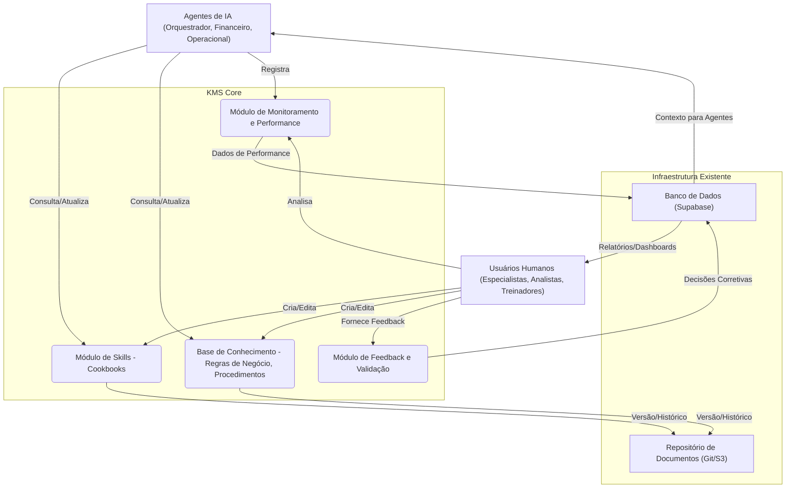

# Estratégia de Integração de Skills em um Sistema de Gerenciamento de Conhecimento (KMS)

Para maximizar a colaboração e o treinamento de agentes (humanos e de IA) no Cargo Flow Navigator, propomos a implementação de um Sistema de Gerenciamento de Conhecimento (KMS) centralizado. Este KMS atuará como um "cérebro" para o sistema multi-agente, armazenando, organizando e disseminando o conhecimento de forma estruturada.

---

## 1. Propósito do KMS

O KMS visa resolver os seguintes desafios:

-   **Colaboração Aprimorada**: Facilitar o compartilhamento de conhecimento entre equipes e agentes de IA.
-   **Treinamento Eficiente**: Acelerar o onboarding de novos colaboradores e o treinamento de novos modelos de IA.
-   **Consistência Operacional**: Garantir que todos os agentes sigam as mesmas regras e melhores práticas.
-   **Aprendizado Contínuo**: Capturar feedback e decisões para refinar as skills dos agentes ao longo do tempo.
-   **Transparência e Auditoria**: Oferecer um registro claro de como as decisões são tomadas e por quê.

---

## 2. Arquitetura Proposta para o KMS

O KMS será composto por módulos interconectados, aproveitando a infraestrutura existente do Supabase e as Edge Functions.

### Componentes-Chave do KMS:

1.  **Módulo de Skills (Cookbooks)**:
    *   **Função**: Armazenar as definições granulares de cada skill (conforme `estrategia_skills_granular.md`), incluindo objetivo, dados de entrada/saída, lógica de execução, critérios de sucesso e fallbacks.
    *   **Tecnologia**: Arquivos Markdown (`.md`) versionados em um repositório Git (`docs/cookbooks/`), acessíveis via Edge Functions para agentes e interface web para humanos.
    *   **Integração**: Agentes consultam este módulo para entender como executar uma tarefa. Humanos contribuem com novas skills ou atualizam as existentes.

2.  **Base de Conhecimento (Regras de Negócio e Procedimentos)**:
    *   **Função**: Centralizar regras de negócio (ex: limites de aprovação, critérios de rateio), procedimentos operacionais padrão (SOPs), políticas de compliance e regulamentações do setor de transporte.
    *   **Tecnologia**: Tabelas no Supabase (para regras estruturadas), documentos Markdown/PDF (para SOPs e regulamentações) armazenados em S3 e indexados para busca.
    *   **Integração**: Agentes consultam esta base para tomar decisões informadas. Humanos a utilizam para referência e treinamento.

3.  **Módulo de Monitoramento e Performance (AI Insights & Logs)**:
    *   **Função**: Coletar dados sobre a execução das skills pelos agentes, incluindo tempo de resposta, taxa de sucesso, custo de IA, e desvios das regras.
    *   **Tecnologia**: Tabelas `ai_insights`, `workflow_event_logs`, `ai_usage_tracking` no Supabase. Dashboards (ex: Metabase, Grafana) para visualização.
    *   **Integração**: Fornece dados para o treinamento de agentes e para que humanos identifiquem áreas de melhoria.

4.  **Módulo de Feedback e Validação (Human-in-the-Loop)**:
    *   **Função**: Permitir que especialistas humanos revisem e corrijam as decisões dos agentes, fornecendo feedback que alimenta o aprendizado.
    *   **Tecnologia**: Interface de usuário no Cargo Flow Navigator para revisão de `ai_insights` com opções de `aprovar`/`rejeitar`/`ajustar`. Registro de feedback em tabelas do Supabase.
    *   **Integração**: Essencial para o aprendizado supervisionado dos agentes de IA e para a evolução das regras de negócio.

---

## 3. Estratégias de Integração para Colaboração e Treinamento

### 3.1. Para Agentes de IA:

-   **Acesso Programático ao Conhecimento**: As Edge Functions dos agentes (ex: `ai-financial-agent`, `ai-operational-agent`) serão estendidas para consultar o KMS antes de tomar decisões. Por exemplo, um agente pode consultar a Base de Conhecimento para as últimas regulamentações de transporte antes de realizar uma verificação de compliance.
-   **Contexto Enriquecido para LLMs**: Antes de invocar um LLM, o orquestrador pode buscar informações relevantes no KMS (ex: histórico de decisões similares, SOPs aplicáveis) e injetá-las no prompt para melhorar a qualidade da resposta.
-   **Aprendizado por Reforço (Feedback Loop)**: O feedback humano registrado no Módulo de Feedback será usado para ajustar os pesos de modelos de IA ou para refinar as regras de decisão dos agentes baseados em regras.
-   **Geração de Cookbooks Automática/Assistida**: Com o tempo, o sistema pode sugerir a criação de novos cookbooks com base em padrões de decisões humanas repetidas ou em novas regulamentações detectadas.

### 3.2. Para Usuários Humanos (Colaboração e Treinamento):

-   **Portal de Conhecimento Centralizado**: Uma seção dedicada no Cargo Flow Navigator (ou um portal separado) onde os usuários podem navegar, pesquisar e contribuir com os cookbooks das skills, regras de negócio e SOPs.
-   **Treinamento Contextual**: Ao interagir com o sistema, os usuários podem receber sugestões de leitura do KMS. Por exemplo, ao revisar uma cotação com margem baixa, o sistema pode sugerir o cookbook da skill "Inteligência de Precificação e Margem" e os procedimentos para negociação.
-   **Feedback Direto na UI**: Conforme mencionado no Módulo de Feedback, os usuários poderão corrigir ou aprovar as ações dos agentes diretamente na interface, contribuindo para o aprendizado do sistema.
-   **Dashboards de Performance e Auditoria**: Visualizações claras no KMS sobre como os agentes estão performando, quais skills estão sendo mais utilizadas, e onde há necessidade de intervenção humana ou ajuste de regras.
-   **Simulações e Playbooks**: O KMS pode oferecer ambientes de simulação onde novos agentes humanos podem praticar a tomada de decisões, com o sistema fornecendo feedback baseado nas regras e no histórico de sucesso dos agentes de IA.

---

## 4. Próximos Passos

1.  **Definir Estrutura de Conteúdo**: Padronizar o formato dos documentos na Base de Conhecimento (ex: templates para SOPs, regras de negócio).
2.  **Desenvolver Interface de Contribuição**: Criar uma UI para que usuários humanos possam facilmente adicionar e editar conhecimento no KMS.
3.  **Implementar Mecanismos de Busca**: Desenvolver um motor de busca eficiente para que agentes e humanos possam encontrar rapidamente o conhecimento relevante.
4.  **Integrar Feedback Loop**: Conectar o feedback humano diretamente ao processo de refinamento das skills dos agentes de IA.

Esta estratégia de KMS transformará o Cargo Flow Navigator em um sistema que não apenas automatiza tarefas, mas também aprende, evolui e capacita sua equipe de forma contínua.
