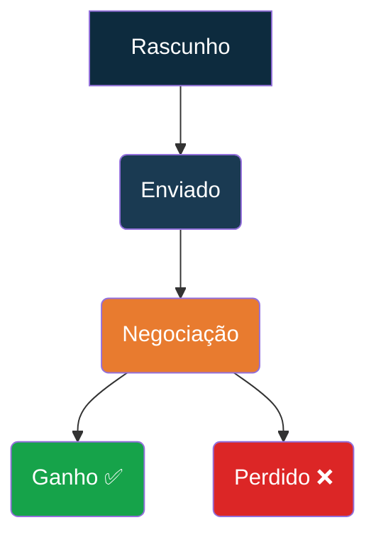

# Template de Dashboard — Saúde do Produto (L1)

> **Público-alvo**: Liderança de Produto, C-Level
> **Frequência de atualização**: Diária
> **Ferramenta**: Supabase Dashboards / Metabase / PowerBI

---

## Visão Geral (Últimos 7 dias vs 7 dias anteriores)

| Métrica North Star | Valor | Tendência |
|:---|:---:|:---:|
| **Ordens de Serviço Gerenciadas com Sucesso** | [Valor] | [📈/📉 +/- %] |

---

## Scorecard de Métricas L1 (Últimos 30 dias vs 30 dias anteriores)

| Métrica | Valor Atual | vs Período Anterior | Meta (OKR) | Status |
|:---|:---:|:---:|:---:|:---:|
| 📈 **Nº de Novas Cotações** | [Valor] | [+/- %] | [Meta] | 🟢/🟡/🔴 |
| 🎯 **Taxa de Conversão (Cotação → OS)** | [Valor] | [+/- %] | [Meta] | 🟢/🟡/🔴 |
| ⚙️ **Nº de Ordens de Serviço Ativas** | [Valor] | [+/- %] | [Meta] | 🟢/🟡/🔴 |
| ✅ **Taxa de Reconciliação de Viagens** | [Valor] | [+/- %] | [Meta] | 🟢/🟡/🔴 |
| 💰 **Receita Bruta (GMV)** | [Valor] | [+/- %] | [Meta] | 🟢/🟡/🔴 |
| ⏱️ **Tempo Médio para Reconciliação (h)** | [Valor] | [+/- %] | [Meta] | 🟢/🟡/🔴 |
| 🤖 **Custo de IA (USD)** | [Valor] | [+/- %] | [Meta] | 🟢/🟡/🔴 |

---

## Funil Comercial (Últimos 30 dias)

| Estágio | Cotações | Taxa de Conversão (para o próximo) |
|:---|:---:|:---:|
| Rascunho | [Valor] | [%] |
| Enviado | [Valor] | [%] |
| Negociação | [Valor] | [%] |
| Ganho | [Valor] | - |
| Perdido | [Valor] | - |

---

## Saúde Operacional e IA (Últimos 7 dias)

### Performance das Views Analíticas

| View | Tempo Médio de Execução (ms) |
|:---|:---:|
| `v_cash_flow_summary` | [Valor] |
| `v_quote_order_divergence` | [Valor] |
| `v_trip_financial_details` | [Valor] |
| `v_trip_payment_reconciliation` | [Valor] |

### Uso das Edge Functions de IA

| Função de IA (`analysis_type`) | Nº de Chamadas | Custo Total (USD) | Taxa de Sucesso |
|:---|:---:|:---:|:---:|
| `financial_anomaly` | [Valor] | [Valor] | [%] |
| `compliance_check` | [Valor] | [Valor] | [%] |
| `driver_qualification` | [Valor] | [Valor] | [%] |
| `operational_report` | [Valor] | [Valor] | [%] |

---

## Legenda de Status

- 🟢 **Verde**: Acima da meta ou melhorando na direção certa.
- 🟡 **Amarelo**: Estável ou ligeiramente abaixo da meta. Requer atenção.
- 🔴 **Vermelho**: Significativamente abaixo da meta ou piorando. Requer investigação imediata.
